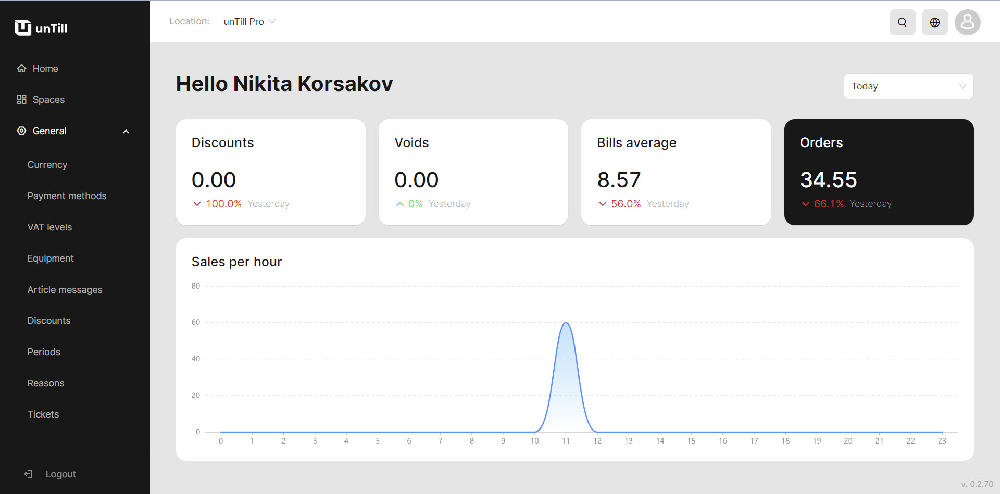

# Back Office Intro

***

### What's the Back Office?

The Back Office serves as the central hub for managing your business. From the Back Office, you can make changes that will be reflected on the Point of Sale (POS) system and access comprehensive information about your business.

### Features in the Back Office

Within the Back Office you can modify and add products to your inventory, create menus, and set up discounts. It also enables you to add POS Users (waiters) to your account, allowing for collaboration and user-specific access levels. Additionally, you can connect and manage various devices associated with your account.

### Spaces in the Back Office

One of the key features of the Back Office is the capability to create and customize 'Spaces'. These 'Spaces' provide a visual representation of your table areas, where your staff can efficiently receive and serve clients. By customizing these 'Spaces', you can optimize the layout and organization of your restaurant.

### Standard functions on a page in the Back Office

On each configuration page in the Back Office, you can edit or delete objects by hovering over the item's row and clicking the respective 'edit' or 'delete' icon.

<figure><figcaption></figcaption></figure>

From any page within the Back Office, you can navigate to 'My profile', which contains information about your subscriptions, locations, and Resellers. This section can be accessed by clicking on the profile icon located at the top-right corner of the page.

<figure><figcaption></figcaption></figure>

### Reports in the Back Office

In the Back Office, you can access detailed reports that provide comprehensive information about your business operations. It helps you to run the business more efficiently.

The Back Office empowers you to clearly comprehend operations, maintain control over your business and enhance the overall efficiency of your workflow. These functionalities make it a vital tool for managing and optimizing various aspects of your business operations.

<figure><figcaption>
Home page with a dashboard
</figcaption></figure>

By following the manuals provided, you can explore the full range of features we offer, beginning with the dashboard and extending to the configuration of Back Office settings. These manuals will guide you through the process of creating products and incorporating other features into your daily workflow.

With a complete understanding of the Back Office, you will be able to create and manage products and take advantage of the available features to enhance the efficiency of your overall operations.
