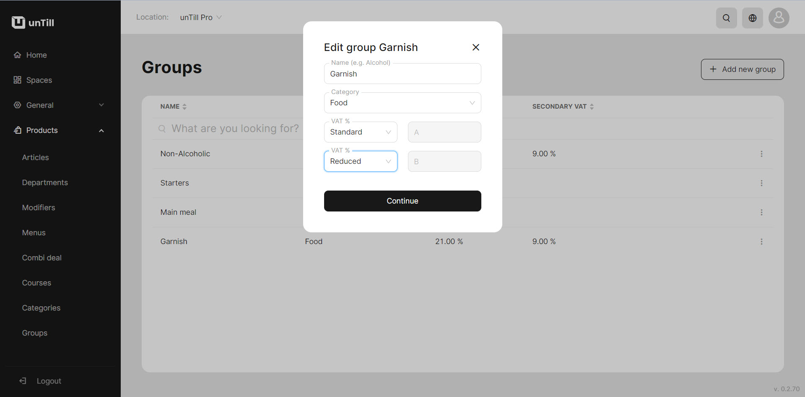

# Add a secondary VAT

***

<table data-card-size="large" data-view="cards" data-full-width="false"><thead><tr><th></th><th></th><th></th></tr></thead><tbody><tr><td><strong>Who can use this feature?</strong></td><td>✔<mark style="color:green;">Location Owners</mark> in the Back Office</td><td></td></tr></tbody></table>

Products can be sold in different 'Spaces', which means that the VAT for each 'Space' can vary. For example, a product sold in a restaurant may have a different VAT rate compared to the same product sold directly at a point of sale. To accommodate this, there is a need to add a secondary VAT to individual items when necessary.

This manual will provide you with a step-by-step guide on how to add a second VAT to an item. By following these instructions, you will be able to accurately assign the appropriate VAT rate to each product based on its 'Space'.

To add a secondary VAT, please follow these steps:

1. Navigate to the **'Products' > 'Groups'.**
2. Add a new group or edit an existing one.
3. Add a secondary VAT below the first VAT field.

<figure><figcaption></figcaption></figure>

4. Click **'Continue'**.


You have successfully created a group with a secondary VAT.

