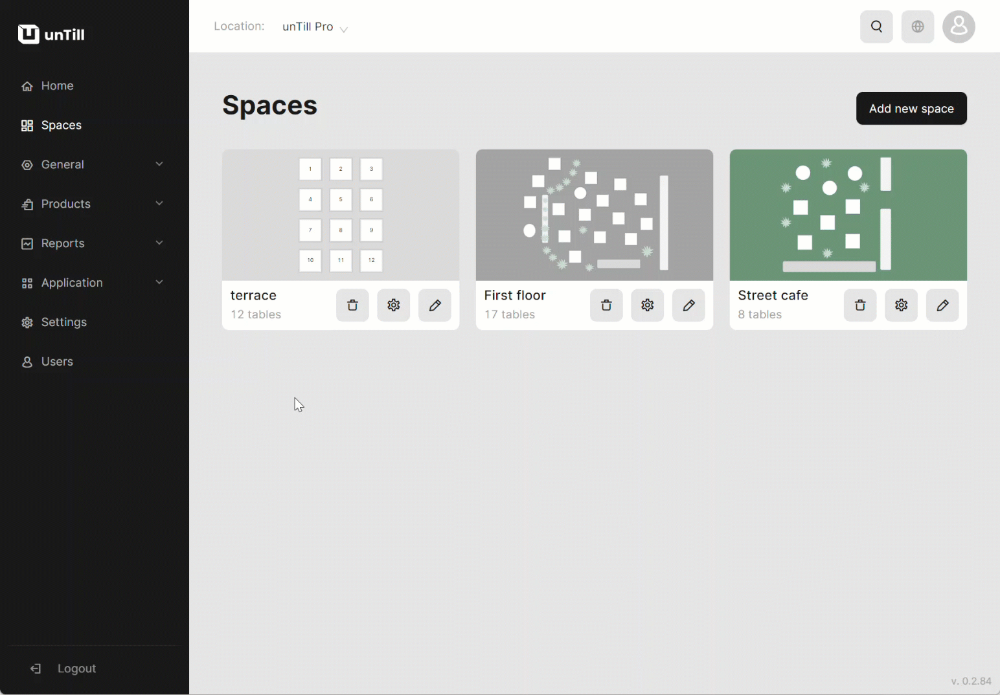

# Manage VAT levels

***

<table data-card-size="large" data-view="cards"><thead><tr><th></th><th></th><th></th></tr></thead><tbody><tr><td><strong>Who can use this feature?</strong></td><td>✔<mark style="color:green;">Location Owners</mark> in the Back Office</td><td></td></tr></tbody></table>

In unTill Air, we provide default VAT levels such as Standard, Reduced, and Zero. However, it's important to note that different countries may have varying VAT rates. For instance, in Sweden, the standard VAT rate is 25%, while in Germany, it's 19%. Therefore, it is recommended to manage and set up VAT levels with their corresponding percentage rates according to your specific region or country.

To **set up VAT levels**, please follow these steps:

1. Navigate to the **'General' > 'VAT levels'**.
2. You are able to:

* Edit the already existing VAT levels if needed;&#x20;
* Add new VAT level to your list;

<figure><figcaption></figcaption></figure>
