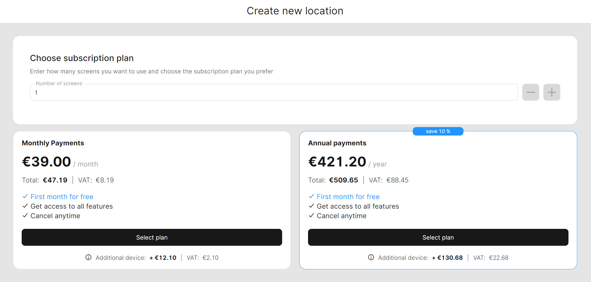

# Locations

In unTill Air we refer to the restaurant you manage as a 'Location', a term commonly used throughout the Back Office to embody all the essential aspects of running your business within our services. Once you sign in to your account and access the pages dedicated to specific locations, you gain the ability to make necessary changes and conduct your business operations.

'Location' represents separate spaces where you have the freedom to modify and manage the various elements to suit your restaurant's needs. With this flexibility, you can efficiently run your business and set it up to your preferences within each individual location.

When creating an account or adding a new location (For more information, please [refer to the designated page](add-new-location.md)), you will configure and accept a subscription plan. With the plan, you initially get one location with assigned screens (If you need to extend the number of screens within an existing location, you [can find the details on how to do so on the designated page](add-new-screen.md).&#x20;

The subscription plan offers you a free trial of all features in unTill Air. During this trial period, which lasts for two weeks, you can explore and experience the full capabilities of unTill Air at no cost. This gives you the opportunity to decide whether you want to continue using unTill Air or discontinue after the trial.

<figure><figcaption></figcaption></figure>

It's important to note that at the end of the trial period, the payment for the subscription will be automatically deducted from your account, according to the conditions of the subscription.

In unTill Air, you have the flexibility to make changes to your location, add new locations, switch subscription plans, and opt out of the subscription during the trial period.
