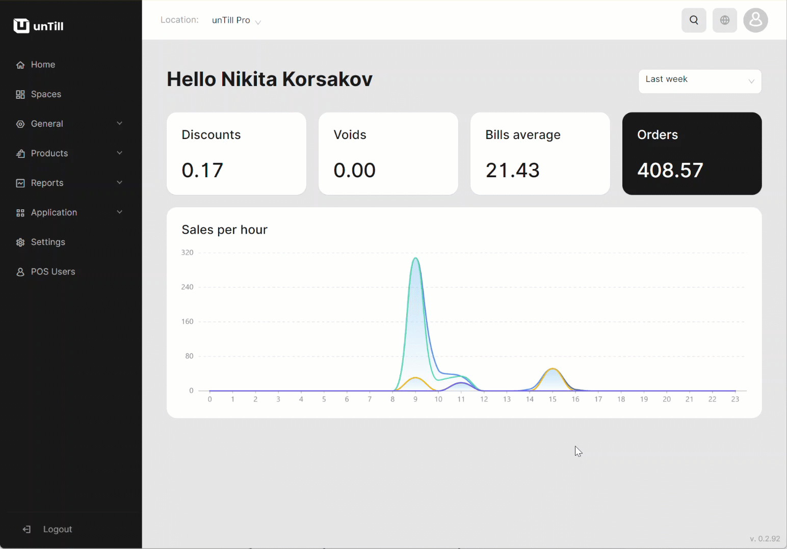

# Actions with location

***

<table data-card-size="large" data-view="cards"><thead><tr><th></th><th></th><th></th></tr></thead><tbody><tr><td><strong>Who can use this feature?</strong></td><td>✔<mark style="color:green;">Location Owners</mark> in the Back Office</td><td></td></tr></tbody></table>

When you create a location in unTill Air, you get a trial version for the first two weeks allowing you to test the system's capabilities. After the trial period ends, the payment will be automatically deducted from your indicated account.&#x20;

As per the specified requirements, you are presented with several options to manage the status of your location. These options provide you with the flexibility to tailor the configuration and functioning of your restaurant to suit your specific needs. You can adjust your location's status per different scenarios, including during trial periods.&#x20;

<figure><figcaption>
Navigating to the My Profile section where you can edit locations
</figcaption></figure>

### Change subscription

In unTill Air, you have the option to change your current subscription plan, allowing you to modify the conditions of your subscription. These conditions include the payment terms (offering options for annual or monthly payments) and the number of screens (tablets) incorporated by the plan. To change the payment terms, simply indicate the desired payment frequency in the checkbox provided.


For more information on changing your subscription to add a new screen, please [refer to the designated page](add-new-screen.md).


### Update payment method

In this section, you can add a new card to pay for the subscription plan. Simply specify that you want to add a new card and provide the required information about your card.

### Cancel your subscription and end the trial period

You can cancel your subscription directly in the Back Office or finish your trial period in advance. By clicking the 'Cancel subscription' button, you will terminate the existing location, making it unavailable for use. However, you can restore this location by taking a new subscription without a trial period. Additionally, you have the option to end the trial period at any time and start using unTill Air on a regular basis.
