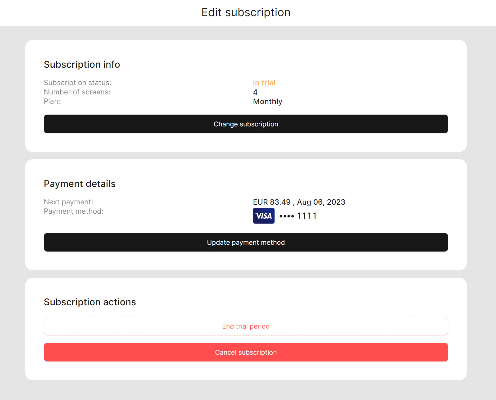
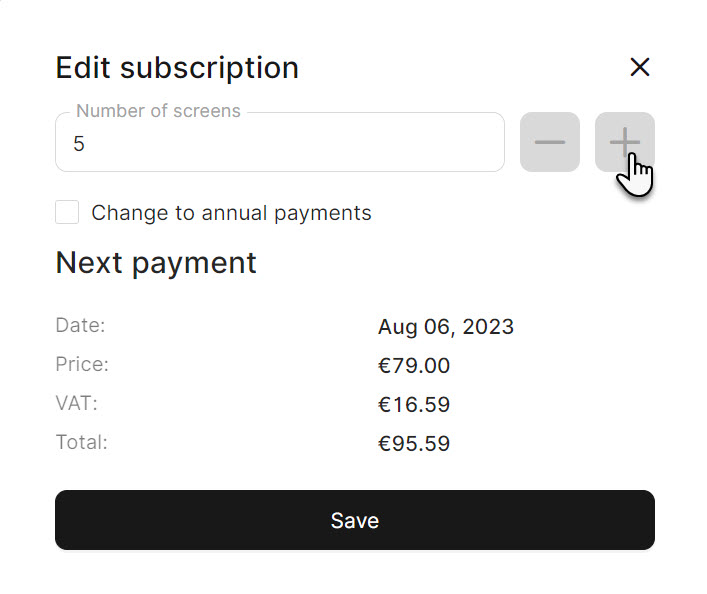

# Add a new screen

<table data-card-size="large" data-view="cards"><thead><tr><th></th><th></th><th></th></tr></thead><tbody><tr><td><strong>Who can use this feature?</strong></td><td>✔<mark style="color:green;">Location Owners</mark> in the Back Office</td><td></td></tr></tbody></table>

In unTill Air, the term 'Screens' refers to the POS tablets that are connected and actively used within our services. When subscribing to unTill Air, you have the option to choose the number of 'Screens' you can use. However, it's important to note that there are limits to the number of 'Screens based on the subscription plan you select.

If you find the need to add a new tablet to your account and the current subscription's limit doesn't allow for it, this manual will provide you with clear instructions on how to add more 'Screens' by renewing your subscription.

To add a new screen to your account, please follow these steps:

1. From any page in unTill Air, you can access your account-related options and settings by tapping on the user account icon located in the top-right corner.

<figure><figcaption></figcaption></figure>

2. Select 'My profile'.
3. Below the title 'My profile', click on 'Locations and subscriptions'.
4. Hover over the location's line and click the respective 'edit' sign.

<figure><figcaption></figcaption></figure>

5. Click 'Change subscription'.
6. You can add as many 'Screens' as you need to your subscription plan.


When you increase the number of 'Screens', the cost of the subscription will be recalculated accordingly.


<figure><figcaption></figcaption></figure>

7. Click 'Save' button.


An alternative way to resolve the problem of a shortage of 'Screens' is by replacing one active tablet with another. This can be done by deleting the current tablet and connecting a new one. For further information about this feature, please [consult the designated page](../general/equipment/delete-a-tablet.md).

