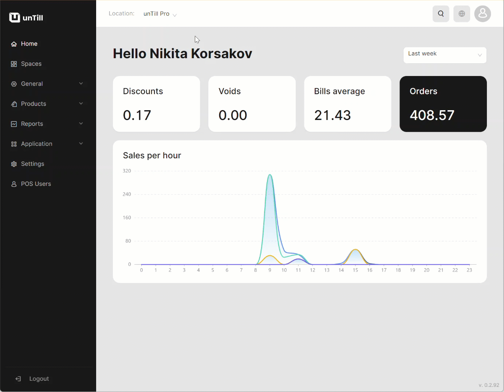

# Location settings

***

<table data-card-size="large" data-view="cards"><thead><tr><th></th><th></th><th></th></tr></thead><tbody><tr><td><strong>Who can use this feature?</strong></td><td>✔<mark style="color:green;">Location Owners</mark> in the Back Office</td><td></td></tr></tbody></table>

Within unTill Air you are free to manage location settings.

<figure><figcaption>
Navigating to the Settings section
</figcaption></figure>

These settings allow you to manage:

* Work start time for your restaurant:

This feature helps you to specify the exact time when work or business operations are scheduled to begin.

* Logoff of the POS User (in seconds):

This feature allows you to set a specific time limit for how long POS User can remain logged in without any activity. If the waiter doesn't perform any actions within the app during this specified time, the system will automatically log them off.

* Happy hour period:

This feature allows you to define specific periods for offering 'Discounts'.

* Tickets layouts:

This feature is designed to allow you to customize the layout of tickets or receipts according to your preferences.

* Availability of 'Courses':

You can choose whether to work with 'Courses' or without them, depending on your operational needs.
