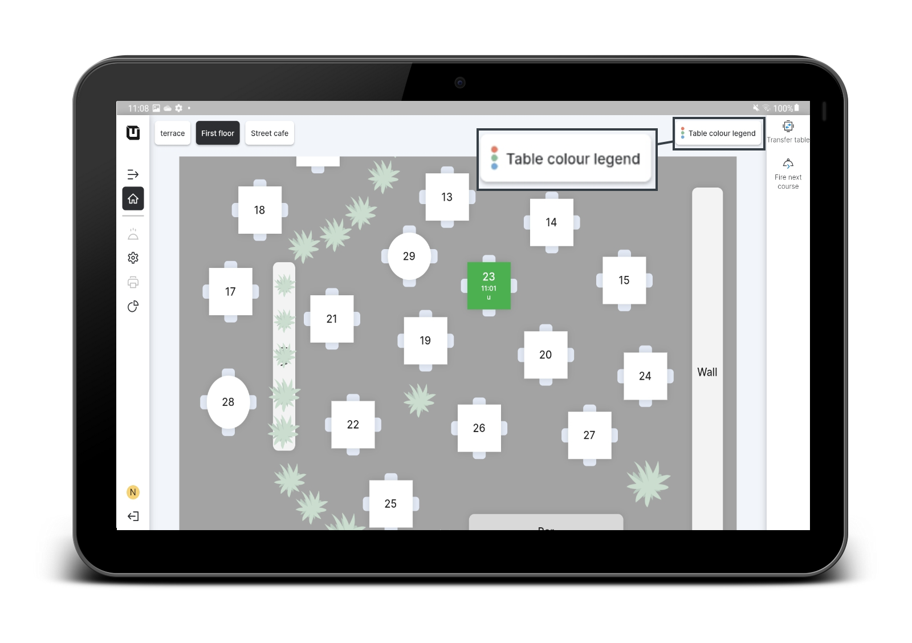
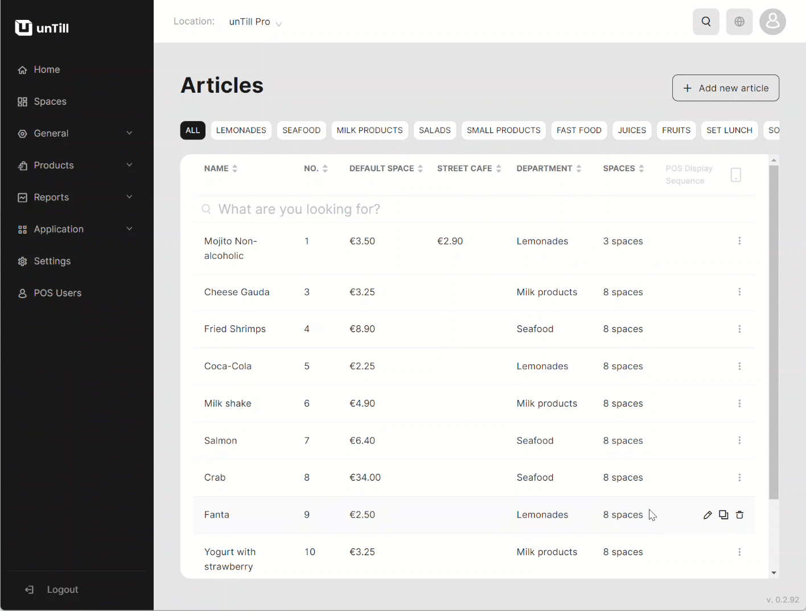
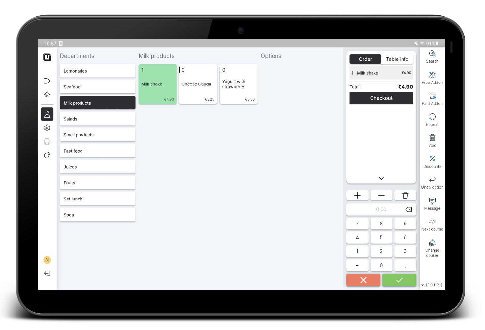

# Colour legend

***

<table data-card-size="large" data-view="cards"><thead><tr><th></th><th></th><th></th></tr></thead><tbody><tr><td><strong>Who can use this feature?</strong></td><td>✔<mark style="color:green;">Location Owners</mark> in the Back Office</td><td>✔<mark style="color:orange;">POS Users</mark></td></tr></tbody></table>

When you work with tables in the 'Space', you can access the 'Table Color Legend' button in the POS. This button displays different colours that represent the allocation of 'Courses' in the POS. These colours are visible in the POS interface when customers order items that are part of a particular 'Course'.

<figure><figcaption></figcaption></figure>


To learn more about the 'Colour Legend' for 'Courses' and how it helps POS Users understand the needs of customers when ordering dishes, please [refer to the designated page](../products/courses/courses-colours.md).


You have the flexibility to customize the colour legend for specific 'Articles.' When these 'Articles' are displayed in the POS, they will be shown in the colour you have selected in the Back Office, making it easier for POS Users to identify and manage different items.

To create a 'Colour legend' for 'Articles' and use it in the POS, please follow these steps:

1. Navigate to the 'Products' > 'Articles' in the Back Office.
2. Create a new 'Article' with a colour or edit an existing one.
3. Click 'Change colour', and then select the colour which you would like to assign to your 'Article'.

<figure><figcaption></figcaption></figure>

4. Open the 'unTill Air' app on your tablet.
5. Create an order with your coloured 'Article'.

<figure><figcaption></figcaption></figure>


You have successfully created and implemented the 'Colour legend' for your 'Articles'!

