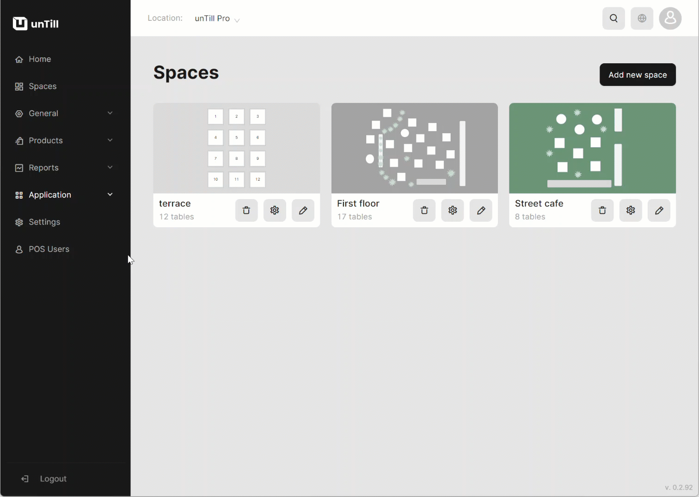
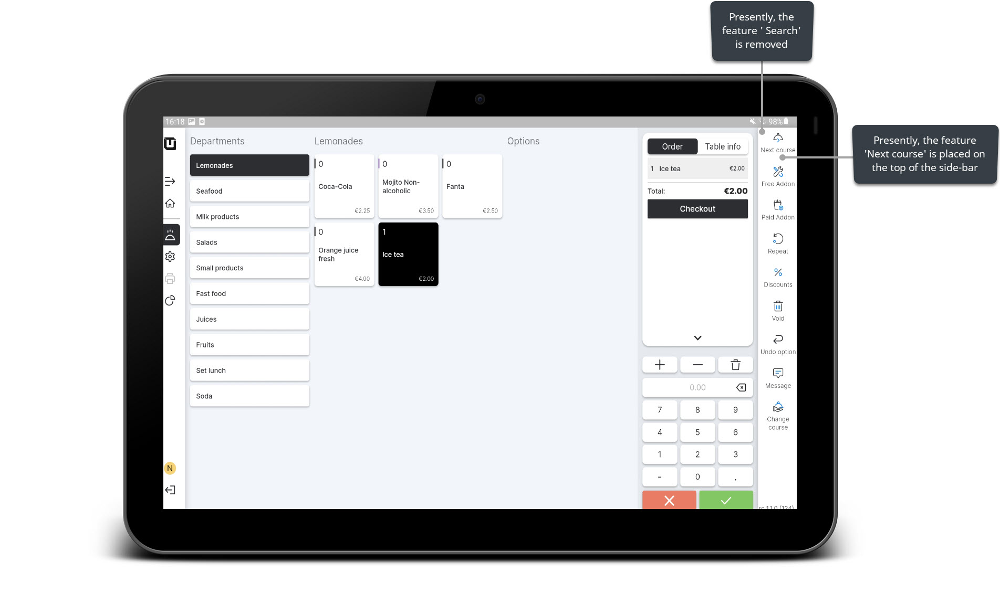

# Manage Action Sets

***

<table data-card-size="large" data-view="cards" data-full-width="false"><thead><tr><th></th><th></th><th></th></tr></thead><tbody><tr><td><strong>Who can use this feature?</strong></td><td>✔<mark style="color:green;">Location Owners</mark> in the Back Office</td><td></td></tr></tbody></table>

In the Back Office, Location Owners can set up POS features and customize how they are displayed for POS Users. This capability is designed to enhance the comfort and efficiency of working with unTill Air. By implementing this feature, you can remove unnecessary functions from the POS and reorganize their sequence and disposition to create an even more user-friendly interface on the tablet application.

To modify POS action sets, please follow these steps:

1. Navigate to the 'Application' > 'POS action sets' in the Back Office.
2. Select any category of the action sets.
3. Here, you can turn on/off these action sets or change their disposition of displaying.

<figure><figcaption></figcaption></figure>

Now, you can see the changes in the displaying of these action sets in the POS application.

<figure><figcaption></figcaption></figure>
