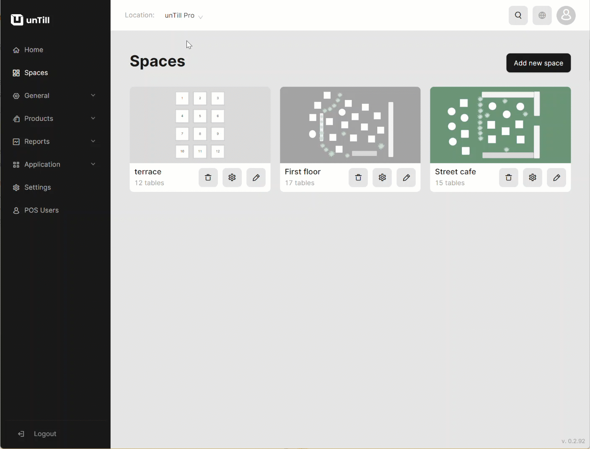

# POS Display Sequence

***

<table data-card-size="large" data-view="cards"><thead><tr><th></th><th></th><th></th></tr></thead><tbody><tr><td><strong>Who can use this feature?</strong></td><td>✔<mark style="color:green;">Location Owners</mark> in the Back Office</td><td></td></tr></tbody></table>

unTill Air offers Location Owners a feature that allows them to customize the display of 'Articles' and 'Departments' in the POS. This helps Location Owners and POS Users organize the items in a more rational and convenient way for efficient work.

To customize the POS display sequence, please follow these steps:

1. Navigate to the 'Products' > 'Articles'.
2. Click on the available specific 'Department'.
3. Click on the 'POS Display Sequence'.
4. Select the device for which you want to configure the sequence.

Options:

* Phone;
* Tablet;
* Wide tablet.

5. Modify the sequence of the items.

<figure><figcaption></figcaption></figure>
