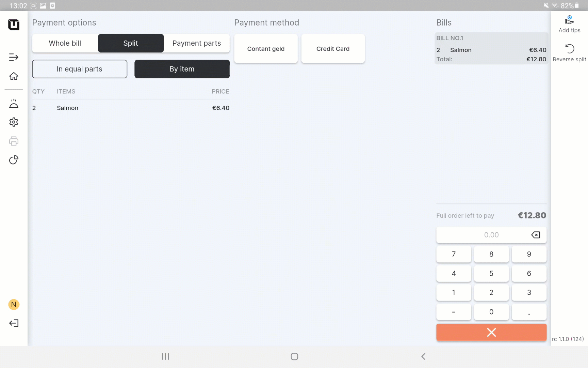

# Split the order

***

<table data-card-size="large" data-view="cards"><thead><tr><th></th><th></th><th></th></tr></thead><tbody><tr><td><strong>Who can use this feature?</strong></td><td>✔<mark style="color:orange;">POS Users</mark></td><td></td></tr></tbody></table>

In unTill Air, customers have the option to split the bill and pay for their orders separately when settling the bill. This convenient feature can be easily implemented by POS Users on the tablet during the 'Checkout' process. It allows to operate in the payment process with flexibility and attention to the individual preferences of customers.

### Split the order with standard items

To split the order, please follow these steps:

1. Open the 'unTill Air' app on your tablet.
2. Create any order.
3. Click 'Checkout'.
4. In the section 'Payment options' select 'Split'.

<figure><figcaption></figcaption></figure>

5. Select the method of splitting:



* Enter the number of parts;
* You'll see separate bills for each part as you indicated;
* Now, you can proceed with a payment for each of these parts in turn;

<figure><figcaption></figcaption></figure>

* You have successfully implemented the 'Split' feature.&#x20;



* Select specific items to be combined into one bill;
* Make a payment for the first combined bill containing the selected items;
* Perform the same actions for the remaining items;

<figure><figcaption></figcaption></figure>

* Each part of the order will be paid using separate bills.




The 'By item' method of splitting offers a convenient solution when one member of the customer's group wants to leave separately. With this option, the POS User can initiate a 'Split' by items, enabling the departing customer to pay for their individual items only. Meanwhile, the other members of the group can continue ordering additional dishes and drinks.


In the 'Payment parts' section, you can view the remaining parts to pay during the splitting process.

### Split the order with repeated items

To split the order by item with repeated items you need to perform additional actions:&#x20;

* To split the repeated item and unitize it, tap on the number '1' on the calculation pop-up;
* Then tap on the item which you need to split;
* This will divide the quantity of the item into separate portions;&#x20;
* Now, you can make a payment for each item separately.

<figure><figcaption></figcaption></figure>


You have successfully split the order and completed the payment.

