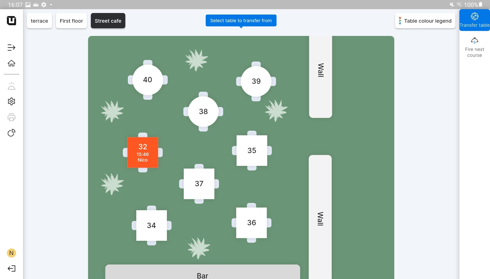
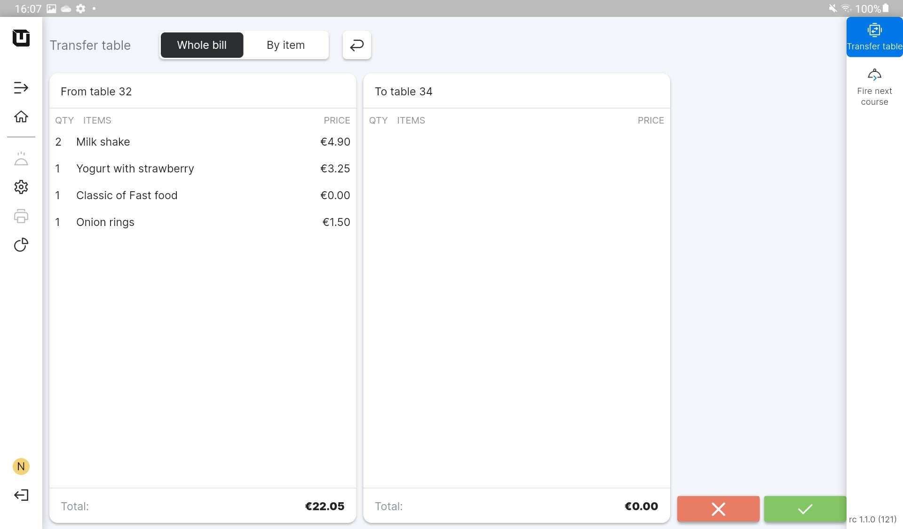
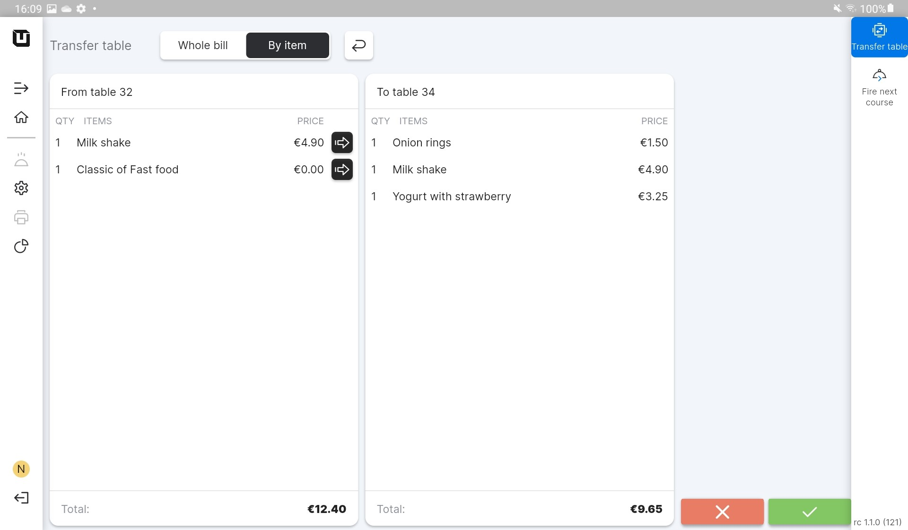

# Transfer table

***

<table data-card-size="large" data-view="cards"><thead><tr><th></th><th></th><th></th></tr></thead><tbody><tr><td><strong>Who can use this feature?</strong></td><td>✔<mark style="color:orange;">POS Users</mark></td><td></td></tr></tbody></table>

In unTill Air POS Users have the flexibility to accommodate customer requests for transferring orders to different tables or even to another 'Space.' To accomplish this, the system offers the 'Transfer table' feature, which allows users to precisely and carefully perform and satisfy the customer's preferences.

To transfer a table, please follow these steps:

1. Open the application on your tablet.
2. Create any order.
3. Click on the 'Transfer table' button located in the top right corner of the POS interface.

<figure><figcaption></figcaption></figure>

4. Select the table to transfer.
5. Click on the table on which you want to transfer the order.

_You have some options here:_

* You can transfer the order to another table within the same 'Space';
* You can transfer the order to another table in a different 'Space';

6. Select what you want to transfer: the whole bill or only the specific items.

<figure><figcaption></figcaption></figure>


You can use the 'Transfer table' button to combine orders from different tables. If customers want to group their orders together, simply transfer the table, and all orders will be grouped accordingly.




Click on the :white\_check\_mark: button to complete a transfer.

<figure><figcaption></figcaption></figure>




Select the specific items which are needed to transfer and click :white\_check\_mark: button.

<figure><figcaption></figcaption></figure>





Now the order has been transferred to another table.

