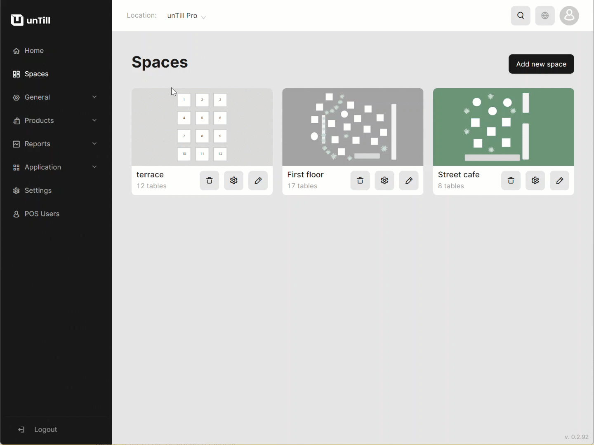

# Manage Articles

***

<table data-card-size="large" data-view="cards"><thead><tr><th></th><th></th><th></th></tr></thead><tbody><tr><td><strong>Who can use this feature?</strong></td><td>✔<mark style="color:green;">Location Owner</mark> in the Back Office</td><td></td></tr></tbody></table>

The 'Articles' play a crucial role in the configuration process within the Back Office, serving as the foundational elements of the entire 'Products' system. That's a reason why creating 'Articles' is one of the most common operations in unTill Air.

To create an 'Article', please follow these steps:

1. Navigate to the 'Products' > 'Articles'.
2. Click 'Add new article'.
3. Provide a name for your new article.
4. Set the price for this article.


Tip: If you have a 'Space' with a 'Special price' feature and you want to set non-identical prices for one article in different spaces, you can [refer to the designated manual](../../spaces/special-price-in-a-specific-space-bo.md) for instructions on how to do so.


5. Select a 'Department' and 'Course'.
6. Assign a new 'Article' to the needed 'Spaces'.

<figure><figcaption></figcaption></figure>

**Optional**:

* You can pick a custom colour for your 'Article', and it will be visible in the POS when the article is included in an order;
* You can add a 'Modifier' to your new 'Article'. For instructions on how to create 'Modifiers', please [refer to the designated manual](../../../products/modifiers/create-modifiers-and-assign-them-to-the-article.md).

7. Click 'Save' button.
