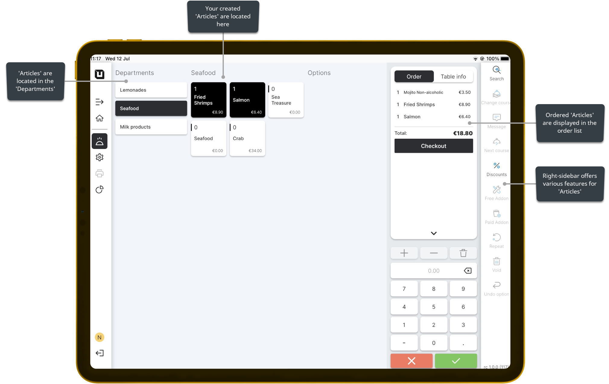

# Use Articles

***

<table data-card-size="large" data-view="cards"><thead><tr><th></th><th></th><th></th></tr></thead><tbody><tr><td><strong>Who can use this feature?</strong></td><td>✔<mark style="color:orange;">POS Users</mark></td><td></td></tr></tbody></table>

After creating **'Articles'** in your inventory, you can utilize them in the POS to process customer orders efficiently. These **'Articles'** become accessible to your POS Users, allowing them to select and add the desired items to the order.

To **use articles**, please follow these steps:

1. Open the application **'unTill Air'** on your tablet.
2. Click on any table in your designated **'Space'** to initiate and process a new order.
3. Now, you can directly see the articles you have created in the POS. These articles are readily available for selection when you are processing customer orders.

<figure><figcaption></figcaption></figure>


Now, you can easily make orders by selecting the desired articles from the list.

