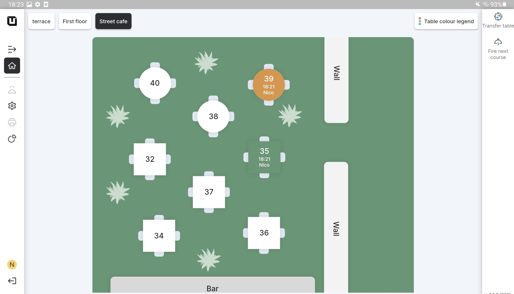

# Courses colours

***

<table data-card-size="large" data-view="cards"><thead><tr><th></th><th></th><th></th></tr></thead><tbody><tr><td><strong>Who can use this feature?</strong></td><td>✔<mark style="color:orange;">POS Users</mark></td><td></td></tr></tbody></table>

In unTill Air, you have the ability to assign specific colors to each Course for better visualization in the POS. Colours serve as an effective way to distinguish one 'Course' from another, which aids POS Users in managing their tasks during busy workflow conditions. This feature enhances the efficiency and organization of order processing in the restaurant.


The colors of the Courses in the POS are visible only when you have enabled 'Separate Courses' in the settings. For more details about setting up 'Separate Courses,' please [refer to the provided manual](../../../products/courses/create-a-course.md).


<figure><figcaption></figcaption></figure>

You can see how these colors look on the **'Table color legend'** located in the top right of the page. At this moment, the color on the table color legend serves as a helpful reminder to the waiter about the currently active **'Course'.**

* Create an order using an existing **'Course'** to see how it will be displayed on the POS User's tablet.

<figure><figcaption></figcaption></figure>
