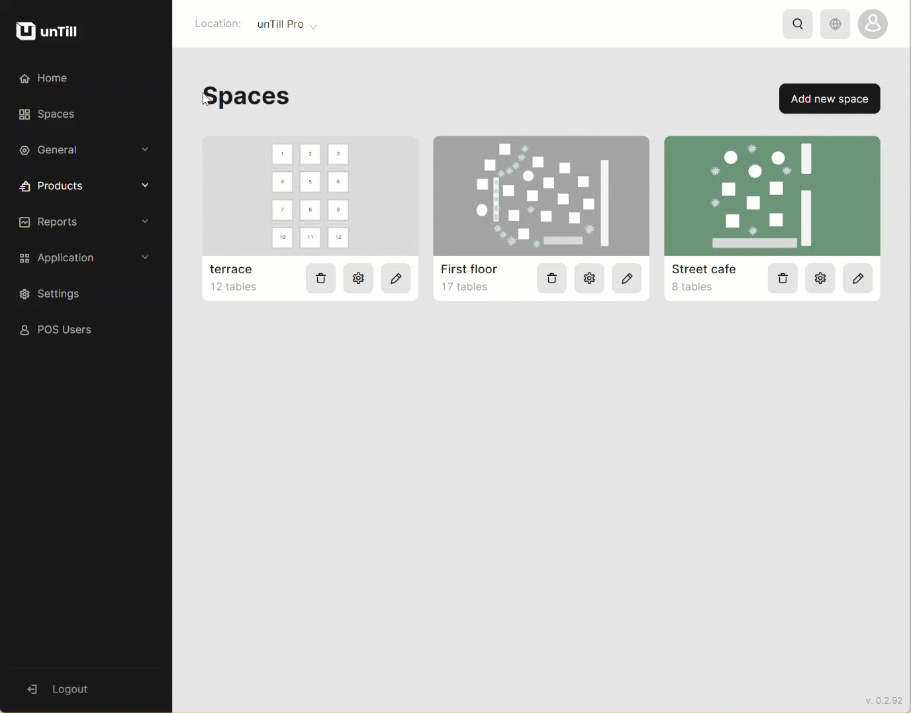

# Disable Courses

***

<table data-card-size="large" data-view="cards"><thead><tr><th></th><th></th><th></th></tr></thead><tbody><tr><td><strong>Who can use this feature?</strong></td><td>✔<mark style="color:green;">Location Owners</mark> in the Back Office</td><td></td></tr></tbody></table>

If you decide not to use 'Courses' in your restaurant operations, you can easily remove them. Once removed, 'Courses' will be immediately deactivated. You won't find the 'Courses' section in the Back Office anymore, and they will no longer be visible during POS operations on the tablet.

To remove 'Courses', please follow these steps:

1. Navigate to the 'Settings' > 'Restaurant'.


To learn more about these customizable settings, including work start time, logoff duration for the POS User, 'Happy hour' periods, ticket layouts, and the availability of 'Courses,' please [refer to the designated page](../../locations/location-settings.md).


2. Make sure that there is no corresponding checkmark in the checkbox 'Available courses'.
3. Click 'Save' button.

<figure><figcaption>
Navigating to the Settings section
</figcaption></figure>

Currently, the 'Courses' feature is not available in the Back Office, and as a result, related features in the POS, such as 'Fire next course' and 'Change course,' have disappeared.
