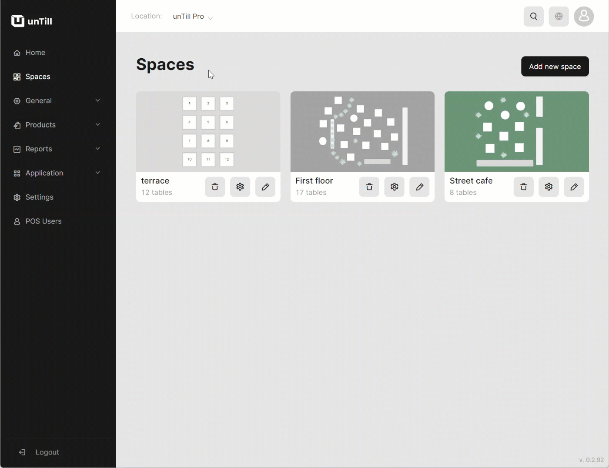

# Manage Groups

***

<table data-card-size="large" data-view="cards"><thead><tr><th></th><th></th><th></th></tr></thead><tbody><tr><td><strong>Who can use this feature?</strong></td><td>✔<mark style="color:green;">Location Owners</mark> in the Back Office</td><td></td></tr></tbody></table>

To create a 'Group', please follow these steps:

1. Navigate to the 'Products' > 'Groups'.
2. Click 'Add new group'.
3. Provide a name to your new 'Group'.
4. Select the 'Category' to which you need to assign the 'Group'.
5. Select the needed VAT level.

<figure><figcaption></figcaption></figure>


While managing the 'Groups,' you have the option to add secondary VAT for your products. For more information on how to do this, please [refer to the designated page](../../general/vat-levels/add-secondary-vat-bo.md).


6. Click 'Continue'.
