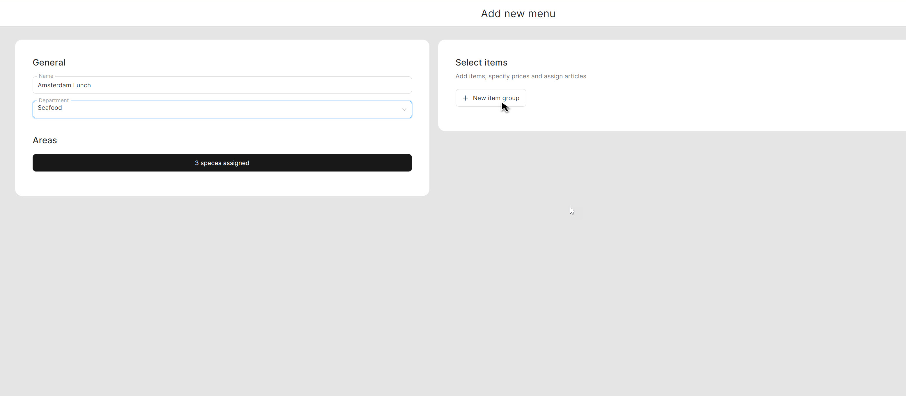
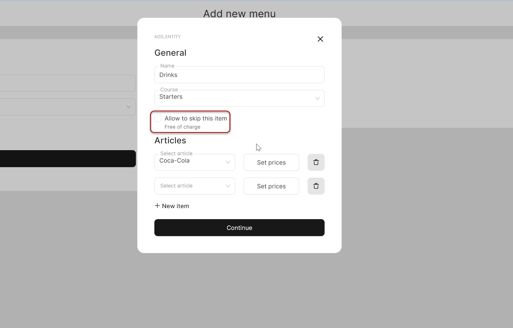

# Manage Menus

***

<table data-card-size="large" data-view="cards"><thead><tr><th></th><th></th><th></th></tr></thead><tbody><tr><td><strong>Who can use this feature?</strong></td><td>✔<mark style="color:green;">Location Owners</mark> in the Back Office</td><td></td></tr></tbody></table>

To create a 'Menu', please follow these steps:&#x20;


While creating a 'Menu', you have the option to either assign it to an already existing 'Department' or create a new 'Department' and assign your 'Menu' to it.




* Navigate to the **'**Products' > 'Departments'.
* Create a new 'Department'.

For a more precise guide on how to create a 'Department', please refer to the [designated page](../departments/manage-departments.md).



Continue to the next sections of the manual, and when the need arises, select one of your existing 'Departments' to proceed.



1. Navigate to the 'Products' > 'Menus'.
2. Click 'Add new menu'.
3. Provide a name to your new 'Menu'.
4. Assign a 'Menu' to a 'Department' and 'Spaces'.
5. Click 'New item group'.

<figure><figcaption></figcaption></figure>

6. Provide a name to your new 'Item group' and select 'Course'.
7. Select 'Articles' to include within your 'Item group'.
8. Pay attention to the 'Allow to skip' feature, which allows your customers to skip one 'Item group' within your menu without any additional charges.&#x20;

<figure><figcaption></figcaption></figure>

9. Create other 'Item groups'.

Optional: POS Display Sequence

This feature allows you to customize the sequence in which 'Item groups' are displayed in the POS. By default, the 'Item groups' are arranged in a certain order, but you have the flexibility to modify this sequence according to your preferences and needs.

10. Click 'Save'.

