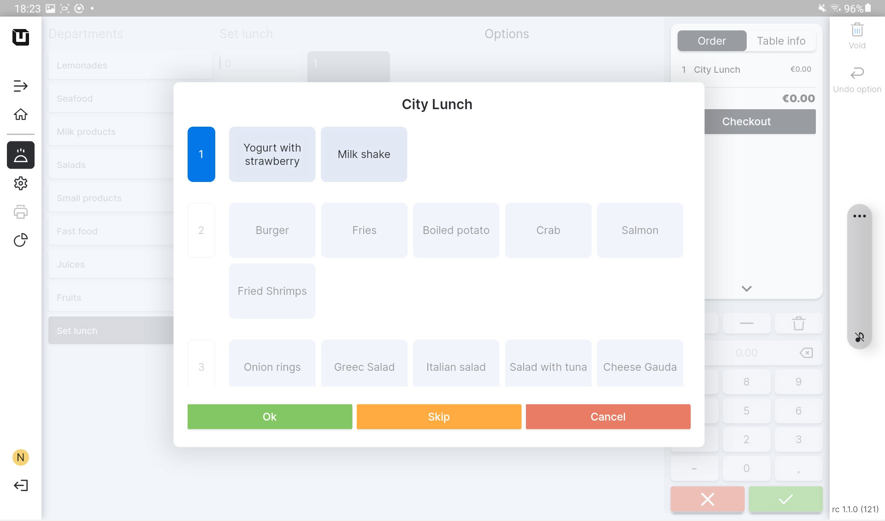

# Use Menus

***

<table data-card-size="large" data-view="cards"><thead><tr><th></th><th></th><th></th></tr></thead><tbody><tr><td><strong>Who can use this feature?</strong></td><td>✔<mark style="color:orange;">POS User</mark></td><td></td></tr></tbody></table>

To use a 'Menu' in the POS, please follow these steps:

1. Open the application 'unTill Air' on your tablet.
2. Create an order using a 'Menu' which you have created.
3. Select the dishes from the 'Item groups'.

<figure><figcaption></figcaption></figure>


You can only skip the 'Item group' designated as 'allowing to skip'.


4. You can choose only one product from each 'Item group'.
5. Click the 'Ok' button to confirm the order for any 'Item group'.&#x20;
