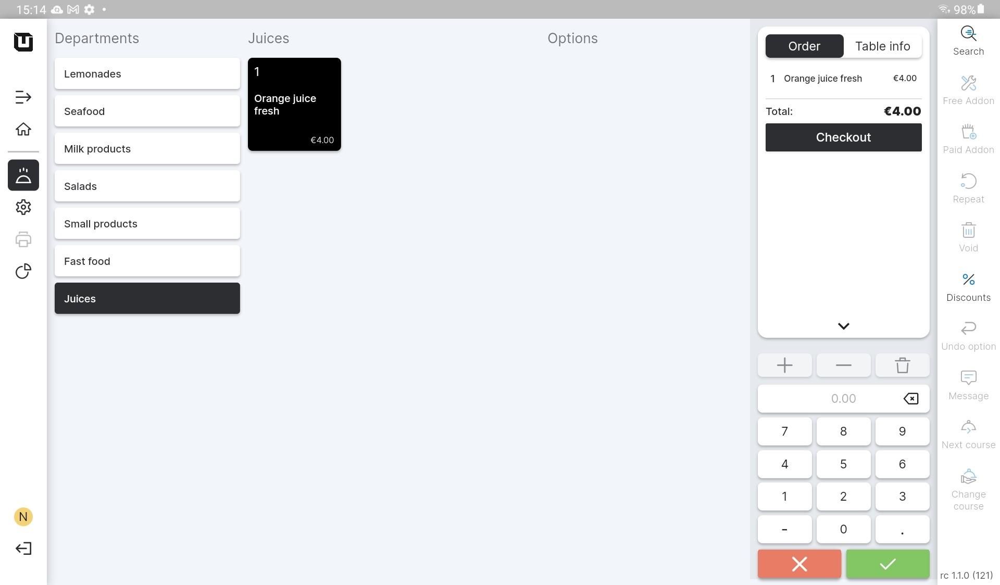

# Direct Sales mode

***

<table data-card-size="large" data-view="cards"><thead><tr><th></th><th></th><th></th></tr></thead><tbody><tr><td><strong>Who can use this feature?</strong></td><td>✔<mark style="color:orange;">POS Users</mark></td><td></td></tr></tbody></table>

### What's the Direct Sales mode?

This mode is specifically designed for Point of Sale businesses that do not have dining spaces where staff accommodates clients. In this mode, the POS does not display any tables, which means you won't have a visual representation of spaces. However, this design allows you to take orders and process them with greater speed and efficiency.&#x20;

This advantage becomes particularly clear for direct sales organizations where the focus is on quick operations. Without the need to manage tables, you can concentrate exceptionally on serving customers and processing their orders seamlessly.&#x20;

<figure><figcaption></figcaption></figure>

### POS User and Direct Sales mode

The 'Direct Sales mode' in unTill Air offers an efficient way for POS Users to configure orders quickly and directly. Instead of working with table layouts, the POS User can access the order list directly, allowing for faster order processing. Additionally, the mode includes powerful search functionality, enabling the POS User to easily find specific 'Articles' within their designated 'Departments'. This means that the user can quickly navigate through the menu, locate items, and add them to the order without the need for table assignments.

### Standard functions in the POS Direct Sales mode

In the 'Direct Sales mode' of unTill Air, all the essential features of the POS function as usual. You have the freedom to create orders and efficiently process them by navigating through 'Departments' and utilizing the 'Search' button for quick access to specific items. Moreover, you retain the ability to implement familiar features, including 'Discounts', 'Void', and other common functions that you are accustomed to.
