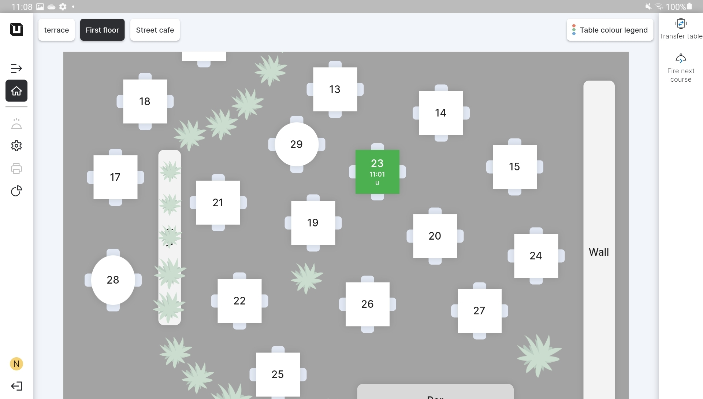

# Table Plan mode

***

<table data-card-size="large" data-view="cards"><thead><tr><th></th><th></th><th></th></tr></thead><tbody><tr><td><strong>Who can use this feature?</strong></td><td>✔<mark style="color:orange;">POS Users</mark></td><td></td></tr></tbody></table>

### What's the Table Plan mode?

This mode is specifically designed for a restaurant business with various 'Spaces', such as a terrace, first floor, or any other distinct 'Spaces'. It allows you to efficiently manage and organize orders in different 'Spaces' within your restaurant.

In the 'Table Plan' mode, you can create a visual representation of the tables in a designated 'Space' within your restaurant. This mode is designed to facilitate the convenient and well-organized accommodation of customers by waiters in different 'Spaces'.

<figure><figcaption></figcaption></figure>

### POS User and Table Plan

In the 'Table Plan' mode, the POS User is provided with an intuitive visual interface that displays the entire 'Space', complete with tables and their corresponding statuses. This mode offers a comprehensive overview of the restaurant's layout, allowing the user to efficiently manage and track the status of each table.

Unlike the 'Direct Sales mode', where transactions are typically processed directly without a visual representation of the tables, the 'Table Plan' mode allows for a more organized and structured approach to table management. POS Users can easily view which tables are occupied, and which are available and even identify tables that require changing the 'Course' if the restaurant works with 'Courses'.&#x20;

### Standard functions in the POS Table Plan mode

Feature 'Search' in the POS allows the POS User to find the particular item quicker in any 'Department.' This feature is equal for both the 'Table Plan' and 'Direct Sales' modes.

The 'Undo' option in the POS provides you with the ability to easily return to the previous step, helping you correct any mistakes or oversights that might occur during the order process. If you accidentally add an item, select the wrong option, or make any other changes, the 'Undo' function comes to your aid. This feature is equal for both the 'Table Plan' and 'Direct Sales' modes.

The 'Transfer table' feature assists the POS User in effortlessly moving an order from one table to another. The POS User can even transfer the entire order or individual items to a table where an existing order is already present. This function is available only in 'Table Plan' mode.


For more information about the 'Transfer table' feature, please [refer to the designated page.](../pos/transfer-table.md)


The 'Fire next course' feature is available exclusively in 'Table Plan' mode. It enables users to quickly signal that a specific table is ready for the next course of their meal. However, it's essential to note that this function won't operate if you have ['Courses' disabled](../products/courses/disable-courses.md).
