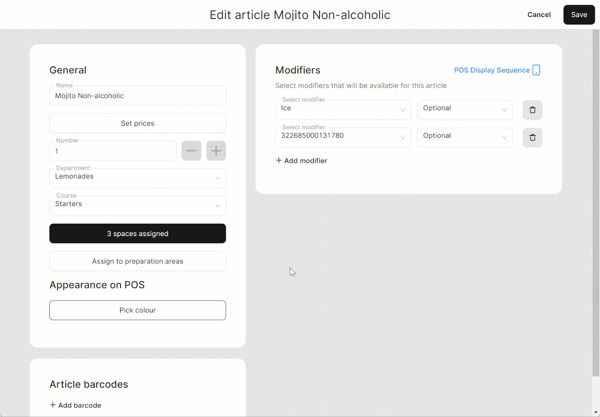

# Assign an Article to a Space

***

<table data-card-size="large" data-view="cards" data-full-width="false"><thead><tr><th></th><th></th><th></th></tr></thead><tbody><tr><td><strong>Who can use this feature?</strong></td><td>✔<mark style="color:green;">Location Owners</mark> in the Back Office</td><td></td></tr></tbody></table>

When you initially created one space and filled it with articles, and now you have created another space, you may wonder how to transfer the previous articles from one space to the other. Here's a brief manual on how to accomplish this action.

To add articles to a new space, please follow these steps:

1. Navigate to the **'Products' > 'Articles'.**
2. Hover by a cursor on the line of a specific category and pick the sign of 'edit'

<figure><figcaption></figcaption></figure>

3. Click on **'№ spaces assigned'** button and select the specific space.

<figure><figcaption></figcaption></figure>

4. Click **'Save'**.


If you need to transfer a department along with its range of articles, you can transfer the entire department instead of individual articles.

