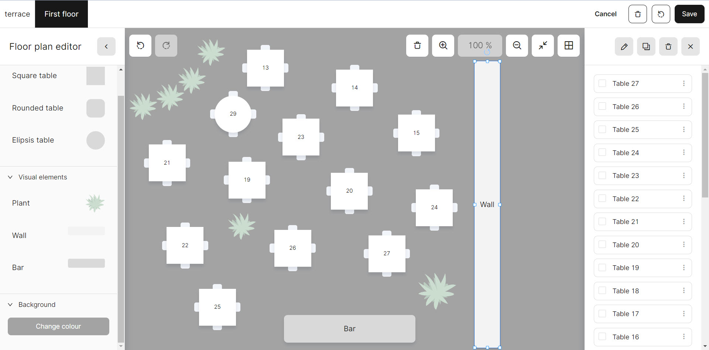

# Manage Spaces

***

<table data-card-size="large" data-view="cards" data-full-width="false"><thead><tr><th></th><th></th><th></th></tr></thead><tbody><tr><td><strong>Who can use this feature?</strong></td><td>✔<mark style="color:green;">Location Owners</mark> in the Back Office</td><td></td></tr></tbody></table>

To set up your 'Space', please follow these steps:

1. Navigate to the **'Space'** on your left sidebar.
2. Click **'Add new space'**
3. Provide a name to your new 'Space' and specify the number of its tables.

* [If you are using a **'Special price'**](special-price-in-a-specific-space-bo.md) for your particular space, it needs to be mentioned

<figure><figcaption></figcaption></figure>

4. Click on the space that just appeared.
5. Now you can modify some settings and conditions of space:

* You can add new tables;
* You can pick the shape, height, width and rotation angle of tables and other subjects;
* You can change the visual elements of space such as the background color and the presence of plants or walls.

<figure><figcaption></figcaption></figure>

6. Click the **'Save'** button after the configuration is completed.

_At the top left corner of the page, you can switch between different spaces._
