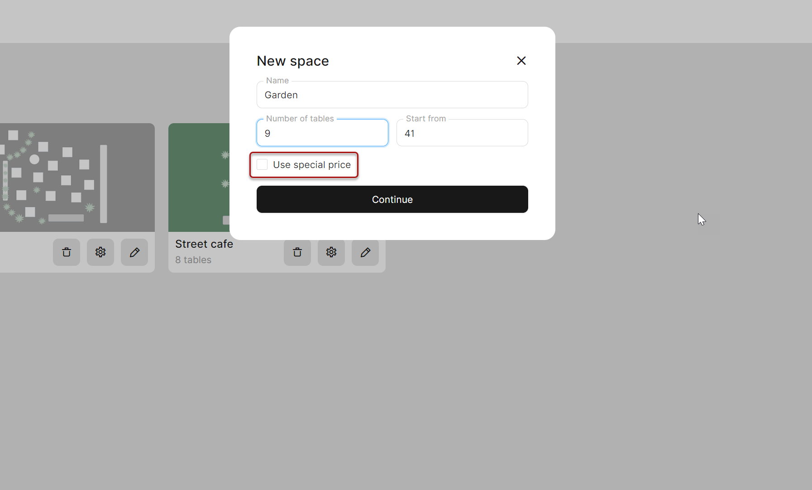

# Special price

***

<table data-card-size="large" data-view="cards"><thead><tr><th></th><th></th><th></th></tr></thead><tbody><tr><td><strong>Who can use this feature?</strong></td><td>✔<mark style="color:green;">Location Owners</mark> in the Back Office</td><td></td></tr></tbody></table>

### Characteristics of the 'Special price'

When creating a new 'Space', you may come across a checkbox that allows you to set a 'Special price' for that specific 'Space'. This feature enables you to have different prices for the same goods in each individual 'Space'. This customization allows for flexibility in pricing based on the particular area or section within your restaurant, catering to varying needs and preferences.

In this example, suppose you intend to establish different prices for beverages in distinct spaces such as a terrace and the first floor. Your preference is to have lower prices for beverages on the terrace compared to the first-floor 'Space'. unTill Air offers you the ability to achieve this through its 'Special price' feature. This feature empowers you to set unique prices for specific spaces, allowing you to use different pricing strategies based on the space within your restaurant.

### Create a 'Special price'

To set up the **'Special price'**, please follow these instructions:

1. Navigate to the **'Spaces'**.
2. Create a new 'Space' or click on the settings of an existing 'Space' for editing.
3. To indicate that you will be using the **'Special price'** feature specifically for this space, select the checkbox provided.

<figure><figcaption></figcaption></figure>

4. Click **'Continue'**.

### Set up a 'Special price'

To set up a special price, please follow these steps:

1. Navigate to the **'Products' > 'Articles'**.
2. Create a new or modify an existing 'Article'.
3. Click **'Set prices'**.

<figure><figcaption></figcaption></figure>

1. Set a new price for the specific 'Space'.
2. Click **'Save'** button.
