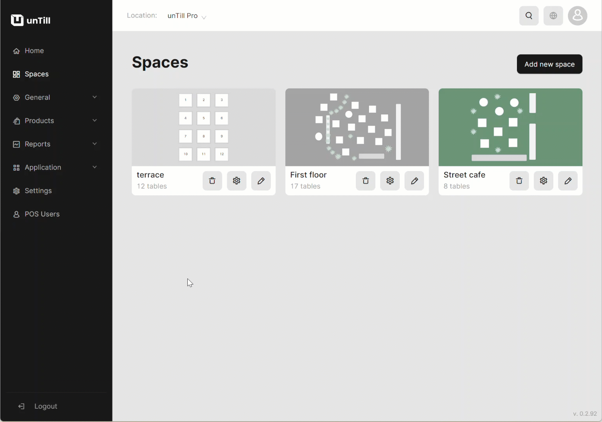

# Request unTill Payments

***

<table data-card-size="large" data-view="cards" data-full-width="false"><thead><tr><th></th><th></th><th></th></tr></thead><tbody><tr><td><strong>Who can use this feature?</strong></td><td>✔<mark style="color:green;">Location Owners</mark> in the Back Office</td><td></td></tr></tbody></table>

To access the full advantages of unTill Payments, you need to complete the registration process for the Payments Portal. To begin, the Location Owner should send a request for Payments Portal access to the Payments Reseller through the Back Office. To make a request, please follow these steps:

1. Navigate to the 'Settings' > 'unTill Payments'.
2. Click 'Request unTill Payments'.

<figure><figcaption></figcaption></figure>

Once the request is submitted in the Back Office (unTill Air), it will be received by a Payments Reseller, who will be notified through an email. The Payments Reseller then proceeds to process the request via the Reseller Portal, resulting in the creation of the Payments Location. Subsequently, the Location Owner receives an invitation to access the newly created Payments Location.

To begin working with unTill Payments, the Location Owner needs terminals. The owner initiates the process by requesting terminals from the Payments Reseller. The Payments Reseller then forwards this application to unTill, indicating the recently created Payments Location.

Upon receiving the request from the Payments Reseller, unTill links the terminals to the specific Payments Location and arranges for their delivery to the Location Owner. Once the terminals are received, it is the authority of the Location Owner to activate them.

After completing the previous steps, the Location Owner receives an invitation from the Payments Portal. By completing the Sign Up process, the Owner gains access to and can set up the Payments Portal.
