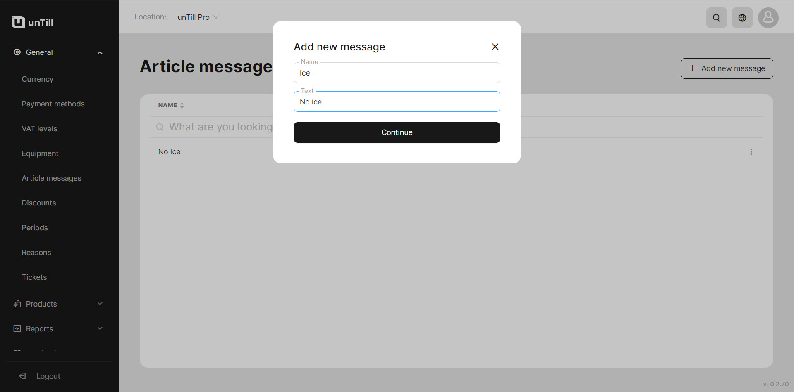

# Manage Article messages

***

<table data-card-size="large" data-view="cards" data-full-width="false"><thead><tr><th></th><th></th><th></th></tr></thead><tbody><tr><td><strong>Who can use this feature?</strong></td><td>✔<mark style="color:green;">Location Owners</mark> in the Back Office</td><td></td></tr></tbody></table>

To create the 'Article messages', please follow these steps:

1. Navigate to the 'General' > 'Article messages'.
2. Click 'Add new message'.
3. Provide a name to your new 'Article message'.
4. Type the text of your message.

<figure><figcaption></figcaption></figure>

5. You can create several 'Article messages' (e.g. 'Ice - '\[no ice] ; 'Ice +'\[more ic])
6. Click 'Continue'.


Now you can use 'Article messages' in the POS. To learn about how it implements in the POS, please [refer to the provided manual](use-article-messages-pos.md).

