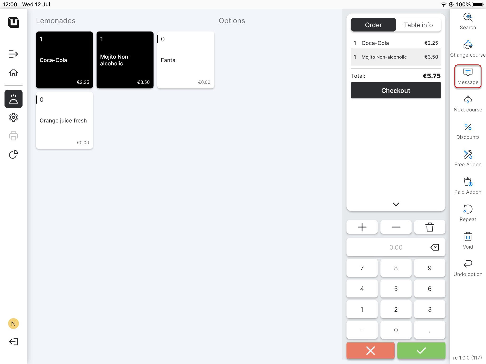
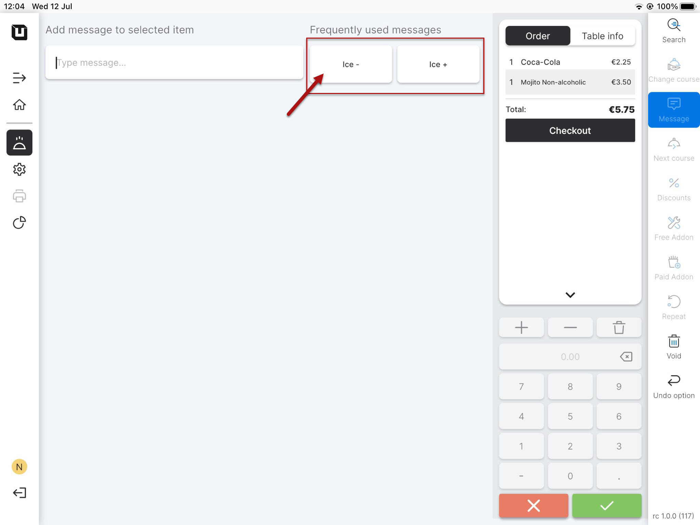

# Use Article messages

***

<table data-card-size="large" data-view="cards"><thead><tr><th></th><th></th><th></th></tr></thead><tbody><tr><td><strong>Who can use this feature?</strong></td><td>✔<mark style="color:orange;">POS Users</mark></td><td></td></tr></tbody></table>

To use an Article message in the POS, please follow these steps:

1. Switch to the application on the tablet.
2. Create any order and click 'Message'.

<figure><figcaption></figcaption></figure>


POS Users can type a message manually, but now, after saving 'Article messages,' you may see them in the 'Frequently used messages' section.


<figure><figcaption></figcaption></figure>

3. Select one of these messages for the item, and the special description of the product from the message will appear under the item name.
