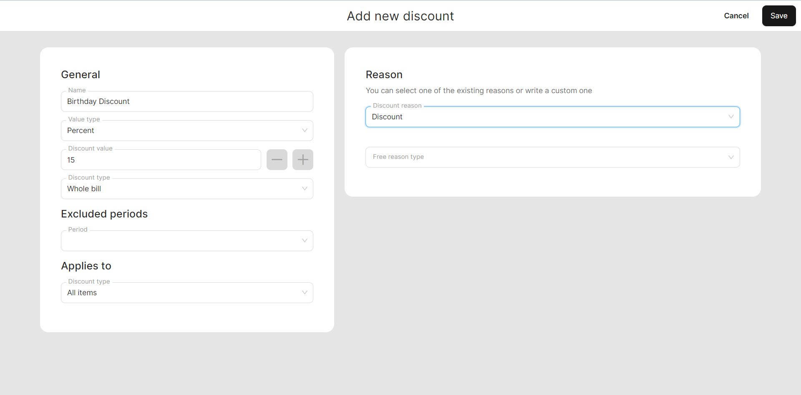

# Manage Discounts

***

<table data-card-size="large" data-view="cards" data-full-width="false"><thead><tr><th></th><th></th><th></th></tr></thead><tbody><tr><td><strong>Who can use this feature?</strong></td><td>✔<mark style="color:green;">Location Owners</mark> in the Back Office</td><td></td></tr></tbody></table>


To manage 'Discounts,' you need to have existing 'Articles.' For instructions on how to create an 'Article', please [refer to the designated page](../../features/products/articles/create-an-article-bo.md).


To add discounts to your list, follow these instructions:

1. Navigate to the 'Discounts' > 'General'.
2. Click 'Add new discount'.
3. Enter the required information about the new 'Discount':

* Name;
* Value type: it can be a percent or a fixed sum of 'Discount';
* Discount value: Enter the percentage rate of the discount if the 'Value type' is set to percent, or enter the specific amount of the discount if it's a fixed discount;
* Discount type: choose 'Whole bill' or 'Selected items' for which the discount will be given;
* Excluded periods: indicate if your discount is unavailable in some periods of time;
* Applies to: Select the specific 'Department', 'Category', or other relevant criteria to which the discount will be applied;
* Reason: select or invent the reason for 'Discount'.

5. When you are finished, click on 'Save' button.

<figure><figcaption>
Example of creating new discount
</figcaption></figure>

