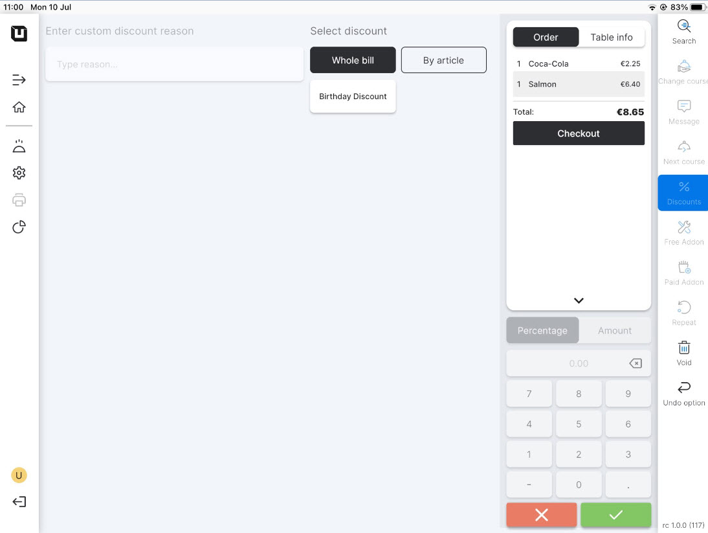
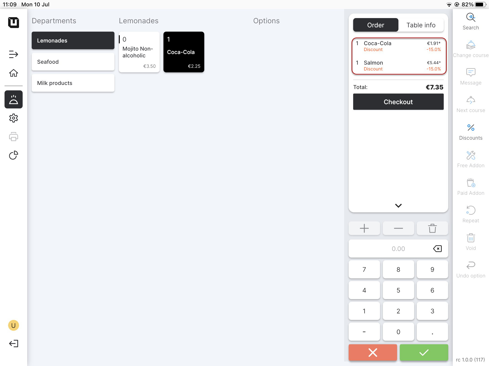

# Use Discounts

***

<table data-card-size="large" data-view="cards" data-full-width="false"><thead><tr><th></th><th></th><th></th></tr></thead><tbody><tr><td><strong>Who can use this feature?</strong></td><td>✔<mark style="color:orange;">POS Users</mark></td><td></td></tr></tbody></table>

To **provide your discounts to your customers**, follow these instructions:

1. To access the **'Discounts'** feature, navigate to the **'Discounts'** section on your tablet connected to the Back Office system (instructions on how to connect a tablet can be found [here](../equipment/add-a-device.md)). You can find this option from the order page.
2. Select the discount which is appropriate to your case.

<figure><figcaption></figcaption></figure>

3. You can see the result in the final bill.

<figure><figcaption></figcaption></figure>

Now that your discounts are ready to be used as part of the restaurant order, you can refer to the manual on [Discounts Reports](../../reports/discounts-reports.md) to enhance your tracking in this area.
