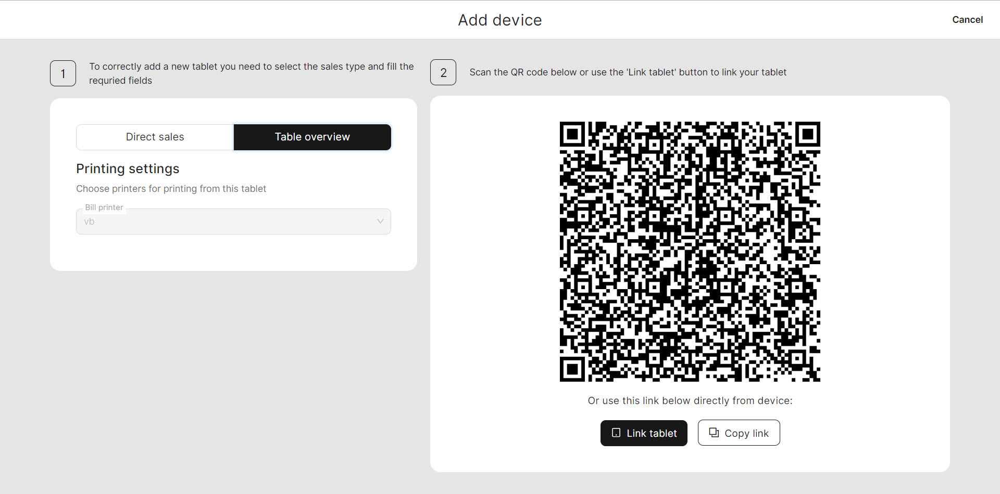
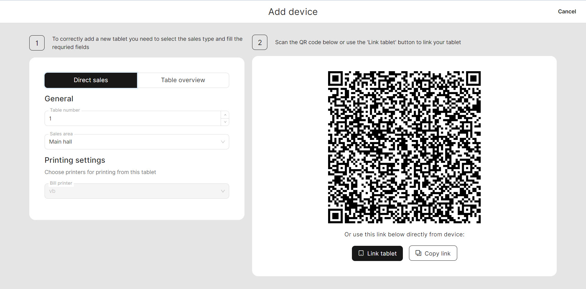

# Add a device

***

<table data-card-size="large" data-view="cards" data-full-width="false"><thead><tr><th></th><th></th><th></th></tr></thead><tbody><tr><td><strong>Who can use this feature?</strong></td><td>✔<mark style="color:green;">Location Owners</mark> in the Back Office</td><td></td></tr></tbody></table>

To efficiently manage restaurant orders within the unTill Air system, it is crucial to establish key devices such as printers, terminals, and tablets.

To add a new device, please follow these steps:

1. Navigate to the 'General' > 'Equipment'.
2. Click 'Add new equipment'.
3. Select what kind of devices you want to establish.


Note: If you have not yet added a printer and terminal to your device list, you will not be able to add a tablet. Therefore, it's necessary to first add a printer and terminal before proceeding to add a tablet.


### Add a new printer

1. Provide a name for your new printer.
2. Please select the aim of using it.
3. Provide the technical information about your printer or choose 'Null printer'.


If you don't have a printer yet, select the 'Null printer' feature to simulate the working process without printing actual receipts.


4. Click 'Save'.

### Add a new terminal

1. Provide a name for your new terminal.
2. Enter the POIID for your terminal.
3. Click 'Continue'.

### Add a new tablet


To add a tablet in the Back Office, you first need to install the 'unTil Air' application on your device.


1. Primarily, you have the choice to select the type of tablet functionality that suits your needs. You can opt for either the ['Direct sales'](../../features/sales-modes/direct-sales-mode.md) mode or the ['Table Overview'](../../features/sales-modes/table-plan-mode.md) mode:



This mode is intended for selling items without designated 'Spaces' and its tables. It consists of a POS that directly sells products to customers. In this mode, you won't see spaces where orders are generated; instead, it will display a simple list of products and generate a bill for the client.



This mode is intended for businesses with 'Spaces' where staff members interact with clients. In this mode, you will have a specific 'Space' in the POS, which can be [set up in the Back Office](../../features/spaces/manage-spaces-bo.md). You will have access to lists of orders from different tables, allowing you to efficiently manage them.&#x20;



#### If you have 'Direct sales' mode:

* Specify the number of tables;
* Select the 'Space' which you'll use;
* Select the printer;
* Scan the QR Code using your tablet.

#### If you have 'Table Plan':

* Select the printer;
* Scan the QR Code using your tablet.

<figure><figcaption></figcaption></figure>

 

<figure><figcaption></figcaption></figure>

