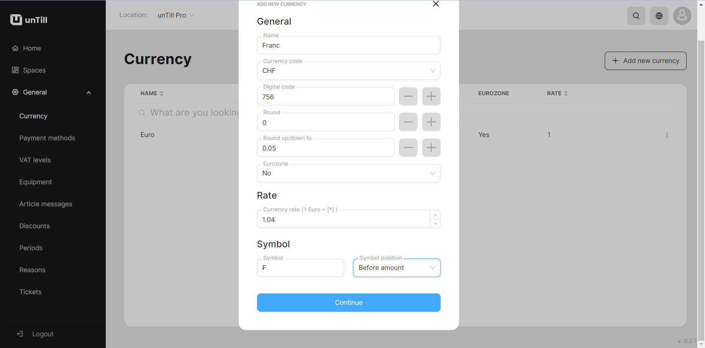

# Currency

***

<table data-card-size="large" data-view="cards" data-full-width="false"><thead><tr><th></th><th></th><th></th></tr></thead><tbody><tr><td><strong>Who can use this feature?</strong></td><td>✔<mark style="color:green;">Owners</mark> in the Back Office</td><td></td></tr></tbody></table>

In unTill Air, you have the ability to add a currency in the Back Office and then implement it for accepting payments in the POS. By default, the currency is set to Euro(€), but you can easily customize it and use other currencies that best suit your business needs.

To add new currencies to your list, please, follow these steps:

1. Navigate to the **'General' > 'Currency'**.
2. Click **'Add new currency'**.
3. Provide the information about the currency:

* Enter the name of the currency;
* Select the currency code;
* Select the values to which you want to round the amount;
* Enter the exchange rate against the Euro(€);
* Select where the symbol of currency will be placed;

<figure><figcaption></figcaption></figure>

4. Click **'Continue'.**
