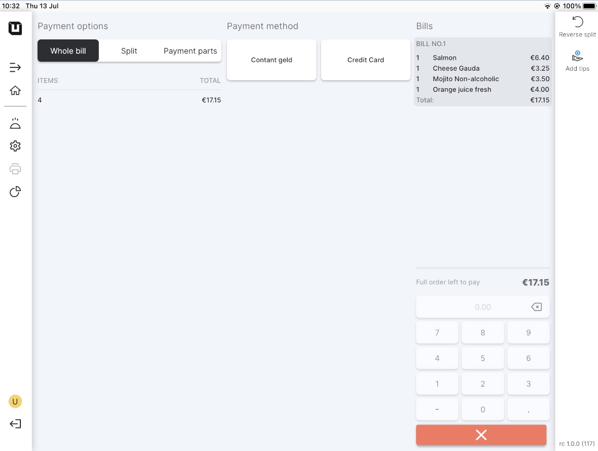

# Payment methods (Card)

***

<table data-card-size="large" data-view="cards" data-full-width="false"><thead><tr><th></th><th></th><th></th></tr></thead><tbody><tr><td><strong>Who can use this feature?</strong></td><td>
✔<mark style="color:green;">Location Owners</mark> in the Back Office

✔<mark style="color:orange;">POS Users</mark> 
</td><td></td></tr></tbody></table>

Payment by cash doesn't require any additional actions from the user. Cash payment normally is a default option and it's available from the first steps in unTill Air. However, cashless payment requires some additional actions, as it assumes access to unTill Payments.

### How to get access to unTill Payments?

To join unTill Payments, please reach out to your reseller if you work with unTill Air through them. If you work unTill Air directly, follow these steps to gain access to unTill Payments without a reseller:

1. Navigate to the **'Settings' > 'unTill Payments'.**
2. If you do not yet have access to the Payments Portal, please submit a request.

<figure><figcaption></figcaption></figure>

3. Navigate to the **'General' > 'Payment methods' .**
4. Click **'Add new payments method'**.
5. Give a name and number of the payment.
6. Select 'cashless' payment kind.&#x20;
7. Click **'Continue'**.

### Use the card in the POS

1. To begin, install and open the **'unTill Air'** application on your tablet (for instructions on how to connect your tablet, please refer to the [provided documentation](../equipment/add-a-device.md)).
2. Create any order on the tablet.
3. Verify the capability of using a card to submit a payment in the POS on the tablet.

<figure><figcaption></figcaption></figure>


Now you have the option to make cashless payments.

