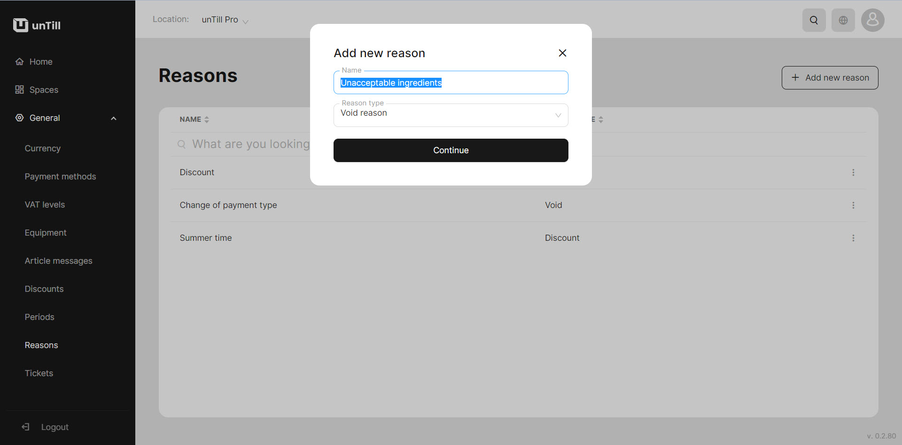

# Manage Reasons

***

<table data-card-size="large" data-view="cards" data-full-width="false"><thead><tr><th></th><th></th><th></th></tr></thead><tbody><tr><td><strong>Who can use this feature?</strong></td><td>✔<mark style="color:green;">Location Owners</mark> in the Back Office</td><td>✔<mark style="color:orange;">POS Users</mark></td></tr></tbody></table>

To create 'Reasons', please follow these steps:

1. Navigate to the 'General' > 'Reasons'.
2. Click 'Add new reason'.
3. Provide a name to your new 'Reason'.
4. Select the 'Reason' type.

<figure><figcaption></figcaption></figure>

4. Click 'Continue'.
