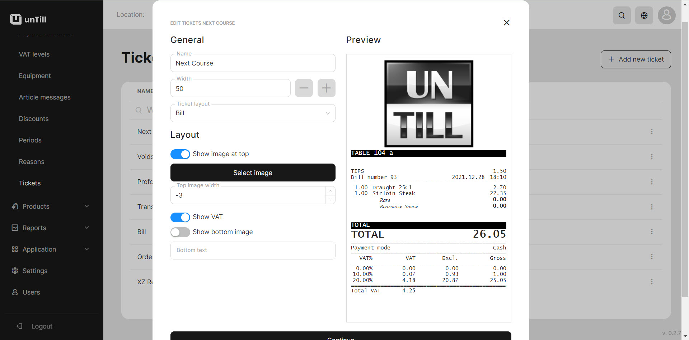

# Manage Tickets

***

<table data-card-size="large" data-view="cards" data-full-width="false"><thead><tr><th></th><th></th><th></th></tr></thead><tbody><tr><td><strong>Who can use this feature?</strong> </td><td> ✔<mark style="color:green;">Location Owners</mark> in the Back Office</td><td></td></tr></tbody></table>

You have the capability to customize various characteristics of the tickets, including modifying their width, incorporating images, displaying or hiding VAT and entering text. This helps you to personalize the tickets according to your preferences and specific requirements.&#x20;

<figure><figcaption></figcaption></figure>

1. Navigate to the **'Tickets'**.
2. Click **'Add new tickets'**.
3. Give a name to a new ticket.
4. Select an appropriate layout.
5. If desired, modify other settings, according to your needs.
6. Click **'Continue'.**
