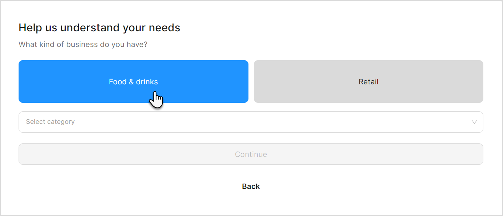
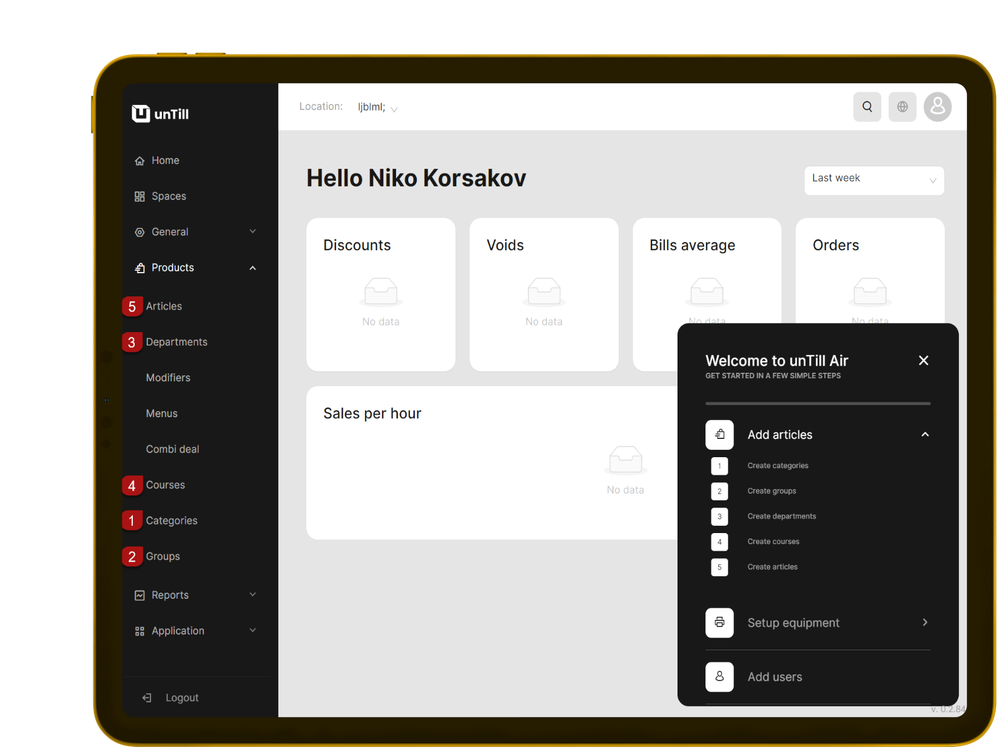
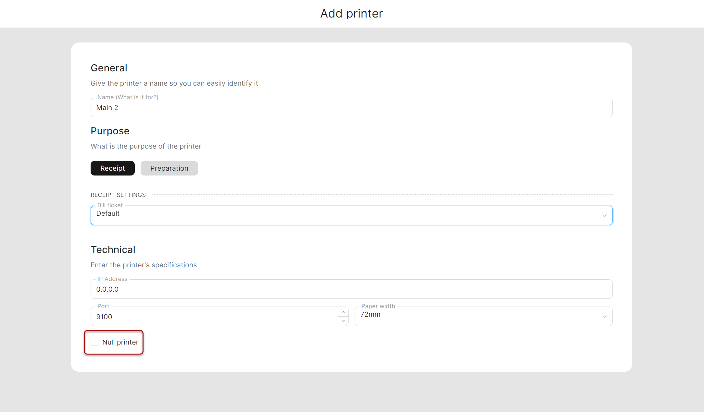
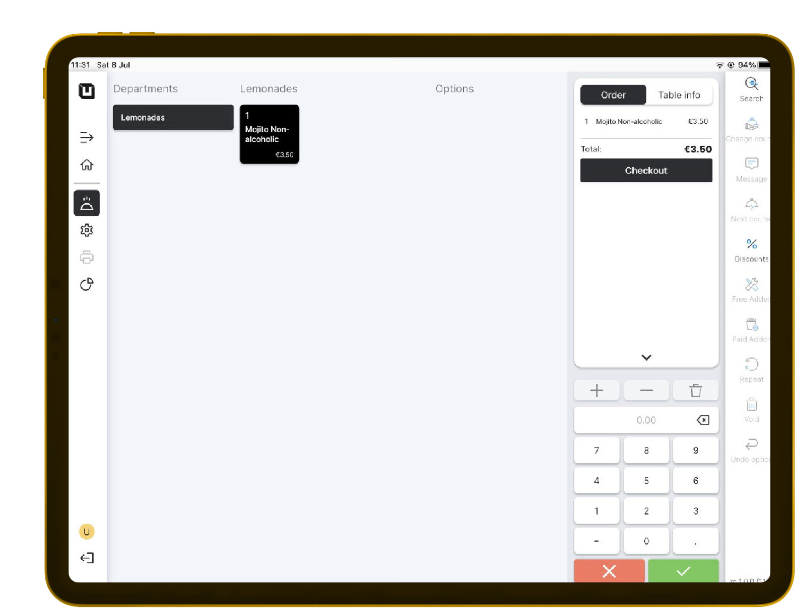

# Quick Start (Food & Drinks mode)

***

**Let's consider how to start working in** [**Table Plan**](../features/sales-modes/table-plan-mode.md) **and** [**Direct Sales**](../features/sales-modes/direct-sales-mode.md) **modes**

To start working in the 'Food & Drinks'

1. Open [https://air.untill.com/](https://air.untill.com/) in your browser.
2. Sign Up.

* Choose 'Food & Drinks';

<figure><figcaption></figcaption></figure>

3. Select the appropriate subscription plan.
4. Choose whether you want to work with or without tables.



If you have tables, select to work with them, create a 'Space', and specify the number of tables.



If you don't work with tables, select that you're not and proceed.



5. Choose whether you want to work with or without 'Courses' and define 'Courses'.
6. Choose whether you want to work with or without 'Happy hours'.&#x20;
7. Create an 'Article' Non-Alcoholic Mojito:

* Add a new 'Category' (Drinks)
* Add a new 'Group' (Non-Alcoholic)
* Add a new 'Department' (Lemonades)
* Add a new 'Course' (Main)
* Add a new 'Article' (Non-Alcoholic Mojito)

<figure><figcaption></figcaption></figure>

8. Navigate to the 'General' > 'Equipment'.
9. Add a printer.


If you don't have a printer yet, select the 'Null printer' feature to simulate the working process without printing actual receipts.


<figure><figcaption></figcaption></figure>

10. Add a tablet.



Add a tablet in 'Table Plan' mode



Add a tablet in 'Direct Sales' mode



11. [Install 'unTill Air' app](../features/pos/application-to-work-in-the-pos.md) on your tablet.
12. Run and scan QR Code on your tablet to connect.
13. Now you can make your first order on the tablet!

<figure><figcaption></figcaption></figure>

You can learn more about the [Back Office](../back-office-intro.md), where you can create articles, and the [POS](../pos-intro.md), where you can place orders. Additionally, we recommend exploring the essential feature of [unTill Payments](../features/untill-payments/).
