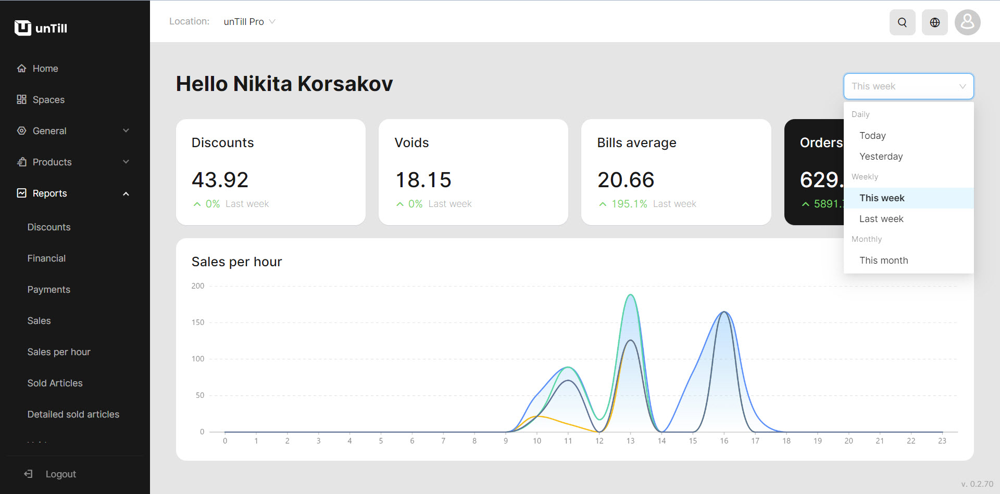

# Home page

<table data-card-size="large" data-view="cards" data-full-width="false"><thead><tr><th></th><th></th><th></th></tr></thead><tbody><tr><td><strong>Who can use this feature?</strong></td><td>✔<mark style="color:green;">Location Owners</mark> in the Back Office</td><td></td></tr></tbody></table>

Your starting point in the Back Office is the 'Home page', which features a dashboard with detailed statistics and concise reports. This manual provides information about the contents of the 'Home page' and its various elements.

<figure><figcaption></figcaption></figure>


On the top right side, you can switch between different periods, allowing you to track reports for specific timeframes.


On this dashboard on a 'Home page' you can see:

* Reports on 'Discounts' (amount of discounts for the selected period)
* Reports on 'Voids' (amount of voids for the selected period)
* Reports on bills average (average amount of bill for the selected period)
* Reports on orders (amount of all orders for the selected period)
