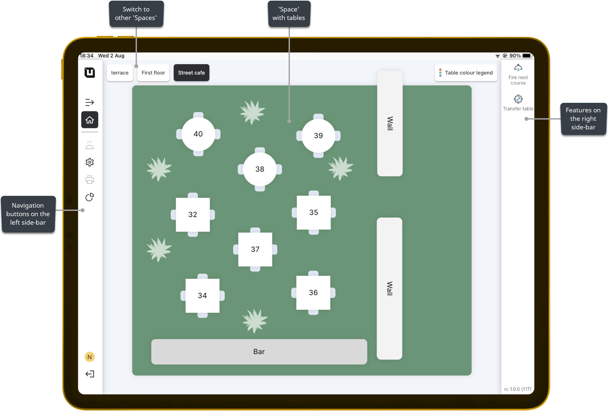

# POS Intro

***

### What's the POS?

POS (Point of Sale) can be described as an adaptable service that empowers users to efficiently create and manage orders within the 'Space'. While POS Users do not have the authority to modify the 'Space' configuration, they possess the capability to provide customers with high-quality service by handling all aspects related to serving dishes and beverages.

### POS Users

In the POS, waiters have access to a wide range of facilities that enable them to cater to the needs of clients effectively. Notably, the POS offers various features designed to enhance the user's experience. These features, once configured in the Back Office, become readily available and accessible to POS Users for implementation during their daily tasks.

### Navigation in the POS

<figure><figcaption></figcaption></figure>

In the POS, you can navigate through buttons located on both the left and right side-bars. These buttons allow you to switch between sections such as the 'Home page' ('Space'), 'Manager' section, 'Order' section, and 'Reports' section, facilitating quicker and more convenient interaction with the POS. On the right side-bar, you'll find various features that are helpful during your interactions with clients.


You can learn more information about these features in the[ 'POS' manual section](features/pos/).


### Spaces in the POS

In the POS, you have the ability to switch between different existing spaces and seamlessly process orders in each of them. This feature enables you to efficiently manage your tasks, especially during busy periods, by swiftly transitioning between spaces and attending to customer needs without any delays. This convenience ensures a smoother workflow and enhances your ability to provide excellent service to your customers.

In the POS display, you will find essential buttons that facilitate navigation between different pages and enable you to perform various actions related to order processing. These buttons provide quick access to important functions like applying discounts, voiding items, and other order-related operations. With a user-friendly interface and intuitive design, the POS empowers you to efficiently manage orders and handle customer requests.
