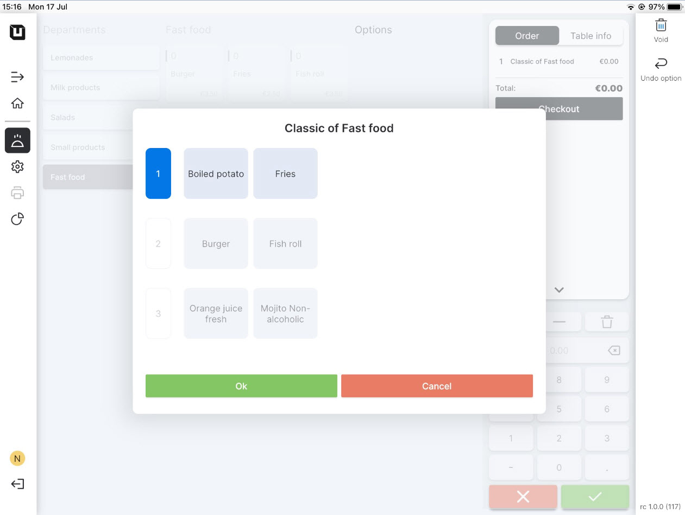
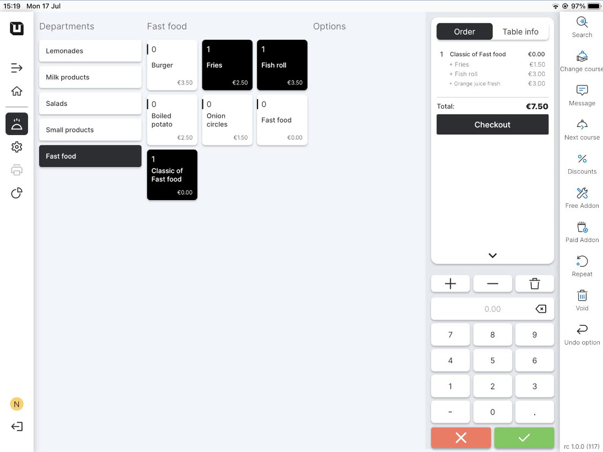

# Use Combi deals

***

<table data-card-size="large" data-view="cards" data-full-width="false"><thead><tr><th></th><th></th><th></th></tr></thead><tbody><tr><td><strong>Who can use this feature?</strong></td><td>✔<mark style="color:orange;">POS Users</mark></td><td></td></tr></tbody></table>

To start using the 'Combi deal' in the POS, please follow these steps:

1. Open the application 'unTill Air' on your tablet.
2. Click on the table in your 'Space' to place an order.
3. Among the 'Articles' in a 'Department' to which you have assigned the **'**Combi deal', you will see the name of your new 'Combi deal', click on it.
4. As a POS User, you have the option to select one item from each line within the 'Combi deal,' based on the customer's preferences.

<figure><figcaption></figcaption></figure>

4. When you are completing the order, you will notice that the 'Articles' included in the 'Combi deal' are listed in the order along with the price you specified.

<figure><figcaption></figcaption></figure>

5. Now you can proceed to finish the order.
