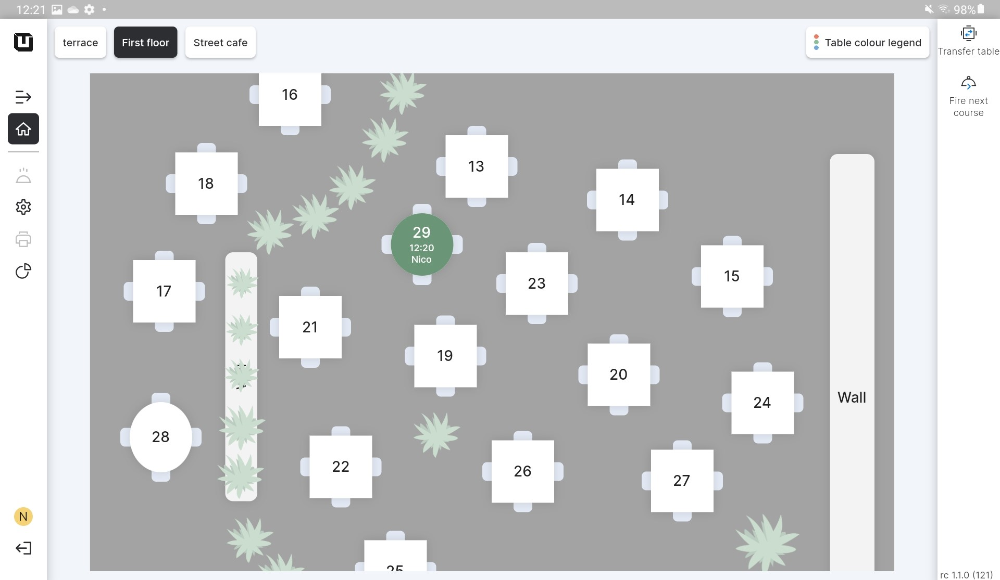
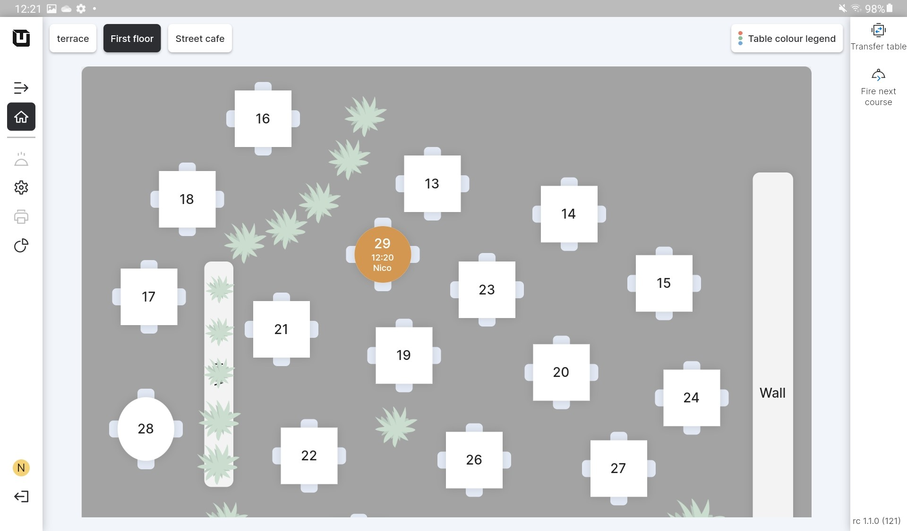
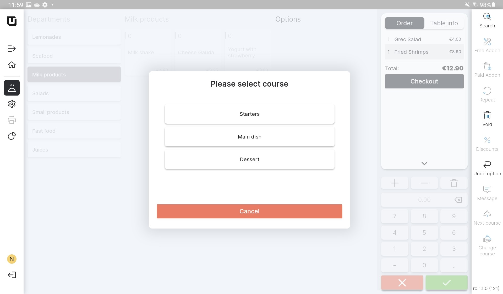

# Use Courses

***

<table data-card-size="large" data-view="cards"><thead><tr><th></th><th></th><th></th></tr></thead><tbody><tr><td><strong>Who can use this feature?</strong></td><td>✔<mark style="color:orange;">POS Users</mark></td><td></td></tr></tbody></table>

To use 'Courses' in the POS, please follow these steps:

1. Open the 'unTill Air' app on your tablet.
2. Create any order with the items which were assigned to specific 'Courses' (e.g. you can create an order with the 'Starter' and 'Main dish').
3. Let's consider typical situations and their solutions for using 'Courses' based on customer preferences.

Situation 1: After the customer has finished the dishes from the previous 'Course', we need to notify the kitchen staff to serve the next course.

To signal the next 'Course' to be served, please follow these steps:

* Create an order with different 'Courses', and then navigate to the 'Home' page, which represents a 'Space' with tables;

<figure><figcaption></figcaption></figure>

Now, the 29th table is highlighted in green, indicating that the 'Starters' 'Course' is being served there.

* In the 'Space' with tables, click on the 'Fire next course' button located in the top-right corner of the page;
* Select a table for the 'Fire next course' feature;

<figure><figcaption></figcaption></figure>

* The color of the 29th table has been changed to indicate that the 'Main dish' course is being served there;

Situation 2: Our customer has requested a modification to the usual serving order. This customer would like the dish that is typically served as a starter to be served later, while the main dish, which is usually served later, should be served earlier.

To ensure the dishes are served exactly as our customer desires in this specific situation, please follow these steps:

* Click on the item in the order list that you need to serve in another 'Course';
* Click 'Change course' button;
* Select the required 'Course' from all the available options;

<figure><figcaption></figcaption></figure>

* Make the same actions with another item by selecting it in the order list and then choosing the desired 'Course' for serving;

In this specific example, we made the following changes:

1. The item 'Fried shrimps', which was originally assigned to the 'Main dish' 'Course', was changed to the 'Starters' 'Course'.
2. The item 'Greek salad', which was initially categorized under the 'Starter' 'Course', was switched to the 'Main dish' 'Course'.

These adjustments allowed us to serve the dishes exactly as our customers requested.

* In the 'Space' with tables, we can see the results of our adjustments: 'Fried shrimps' are now served as a 'Starter,' and 'Greek salad' is served as a 'Main dish.'
