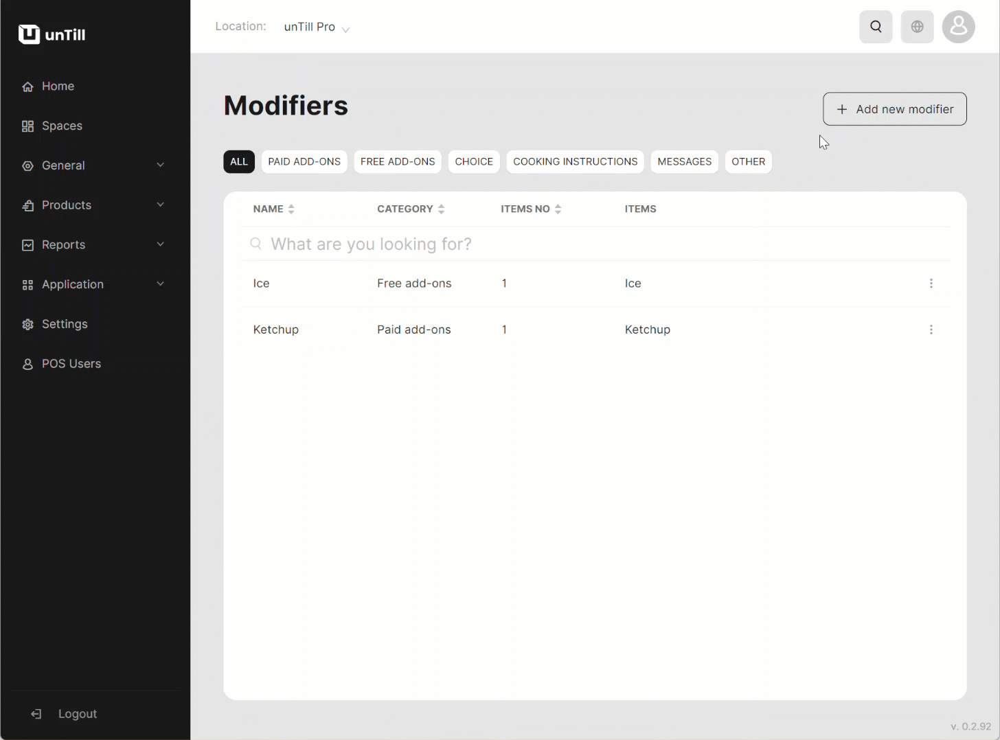

# Manage Modifiers

***

<table data-card-size="large" data-view="cards" data-full-width="false"><thead><tr><th></th><th></th><th></th></tr></thead><tbody><tr><td><strong>Who can use this feature?</strong></td><td>✔<mark style="color:green;">Location Owners</mark> in the Back Office</td><td></td></tr></tbody></table>

To create a 'Modifier', please follow these steps:

1. Navigate to the 'Products' > 'Articles'.
2. [Create a new 'Article'](../../features/products/articles/create-an-article-bo.md) to match the desired 'Modifier'.

_Now, you can proceed directly to creating a 'Modifier'._

1. Navigate to the 'Products' > 'Modifiers'.
2. Click 'Add new modifier'.
3. Provide a name to a new 'Modifier' and select 'Option category'.

<table><thead><tr><th width="287">Option category</th><th>Meaning</th></tr></thead><tbody><tr><td>Paid add-ons</td><td>These 'Modifiers' are provided to customers with an associated price since paid add-ons are intended to require customers to pay for additional ingredients.</td></tr><tr><td>Free add-ons</td><td>These 'Modifiers' are provided to customers for free as they do not require any additional fees from the client.</td></tr></tbody></table>

4. Select items which will be used as a 'Modifier'.
5. Assign a 'Modifier' to a specific 'Article' or several 'Articles'.
6. Set a price for the 'Modifier' 'Article'.
7. Choose between the 'optional' and the 'mandatory' implementation of the 'Modifier' in the POS during taking the order.&#x20;

<table><thead><tr><th width="308">Type of Modifier</th><th>Description</th></tr></thead><tbody><tr><td>Optional</td><td>In this case, the 'Modifier' will be available, but the POS User must select it when the customer requests to add a modifier.</td></tr><tr><td>Mandatory</td><td>In this case, the 'Modifier' will be automatically included as a default option, and the 'Article' will be sold with the 'Modifier' already applied.</td></tr></tbody></table>

<figure><figcaption></figcaption></figure>

When configuring a mandatory 'Modifier,' it becomes necessary to assign multiple items as 'Modifiers' to provide your customers with various choices. By creating several 'Modifiers' for one 'Article,' you gain the capability to offer diverse options to your customers.

8. Click 'Save' button.


You have successfully created a new 'Modifier'. Now, you can start using it within the POS system.

