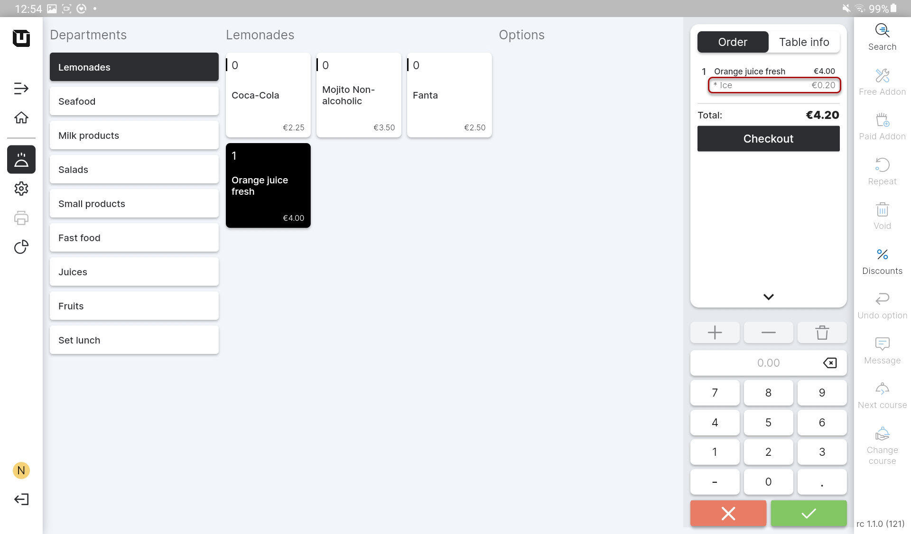
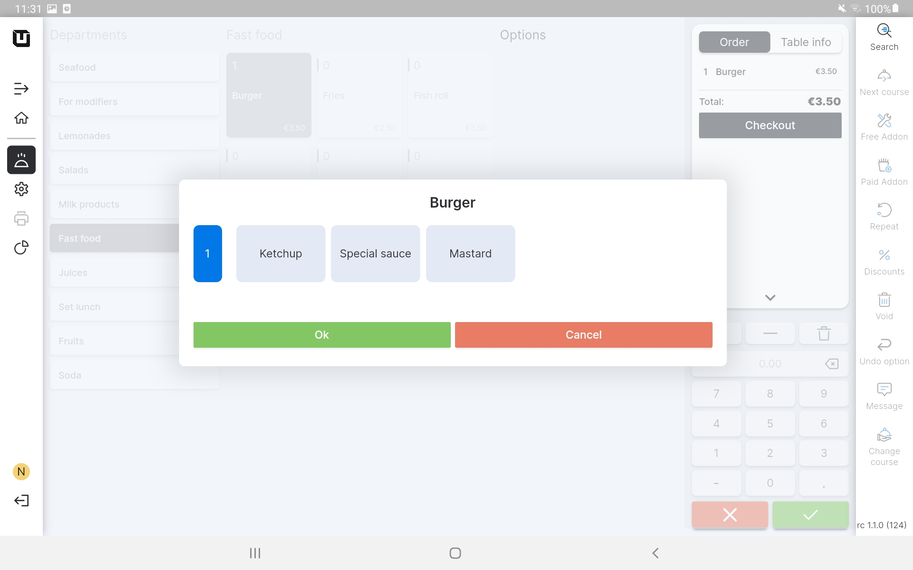
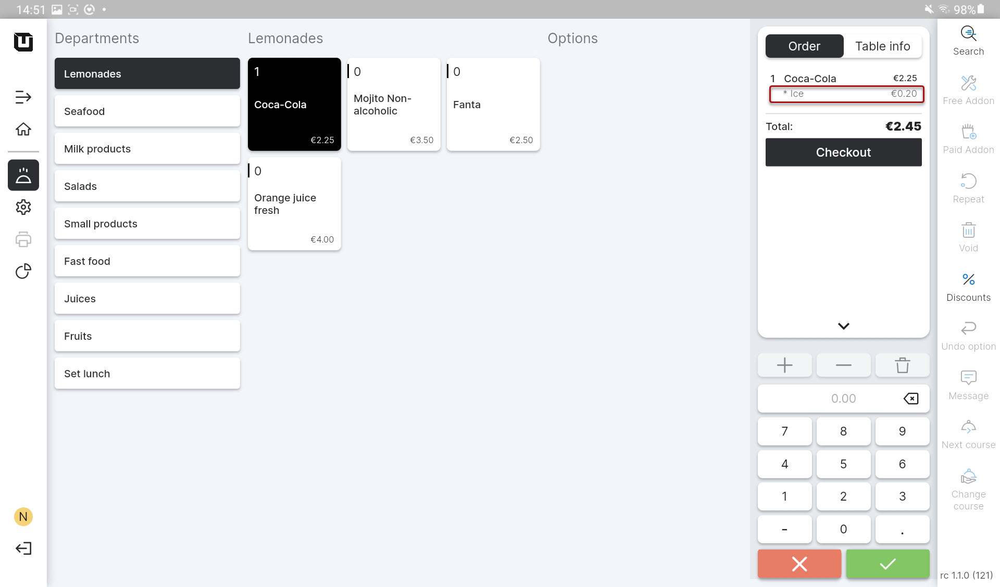

# Use Modifiers

***

<table data-card-size="large" data-view="cards"><thead><tr><th></th><th></th><th></th></tr></thead><tbody><tr><td><strong>Who can use this feature?</strong></td><td>✔<mark style="color:orange;">POS Users</mark></td><td></td></tr></tbody></table>

To start using 'Modifier' in the POS, please follow these steps:

1. Open the application 'unTill Air' on your tablet.
2. Create an order using the 'Article' with a 'Modifier'.
3. Pay your attention to the result with 'Modifiers':

### Optional 'Modifier'

* You'll see initially the item which you've ordered without a 'Modifier';
* If a customer requests to add a 'Modifier', simply tap on the item in the order list to include the desired 'Modifier';

<figure><figcaption></figcaption></figure>


If you set a price for the 'Modifier', it will be applied regardless of any other settings or options.


<figure><figcaption></figcaption></figure>

### Mandatory 'Modifier'

* You'll see the item straight away with a 'Modifier';

If you have several mandatory 'Modifiers' you will be able to choose from different options.

<figure><figcaption></figcaption></figure>

* This item will be sold already with a 'Modifier';

<figure><figcaption></figcaption></figure>
