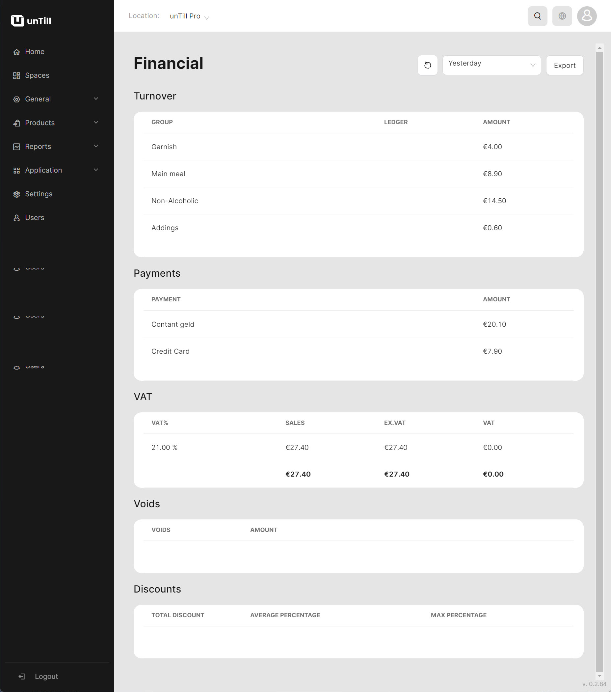

# Financial Reports

***

<table data-card-size="large" data-view="cards"><thead><tr><th></th><th></th><th></th></tr></thead><tbody><tr><td><strong>Who can use this feature?</strong></td><td>✔<mark style="color:green;">Location Owners</mark> in the Back Office</td><td></td></tr></tbody></table>

'Financial Reports' in unTill Air offer a comprehensive overview of the essential financial data related to your restaurant's business.&#x20;

While other reports may focus on specific financial points, such as 'Sales Reports' or 'Payments Reports', 'Financial Reports' provide a broader and more detailed view of all financial elements. This enables the owner to track and analyze various aspects of the restaurant's finances in one centralized spot.

To get the 'Financial Report', please follow these steps:

1. Navigate to the **'Reports' > 'Financial reports'.**
2. Select the period of the report.
3. Now you have access to diverse financial data.

This kind of report includes information about:

* Turnover;
* &#x20;Payments;
* VAT;
* Voids;&#x20;
* Discounts;

<figure><figcaption></figcaption></figure>

_In other words, it's a brief summary of all the other reports._
