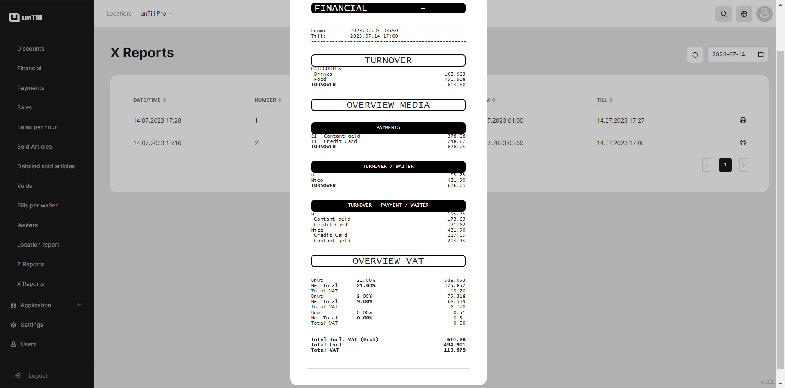
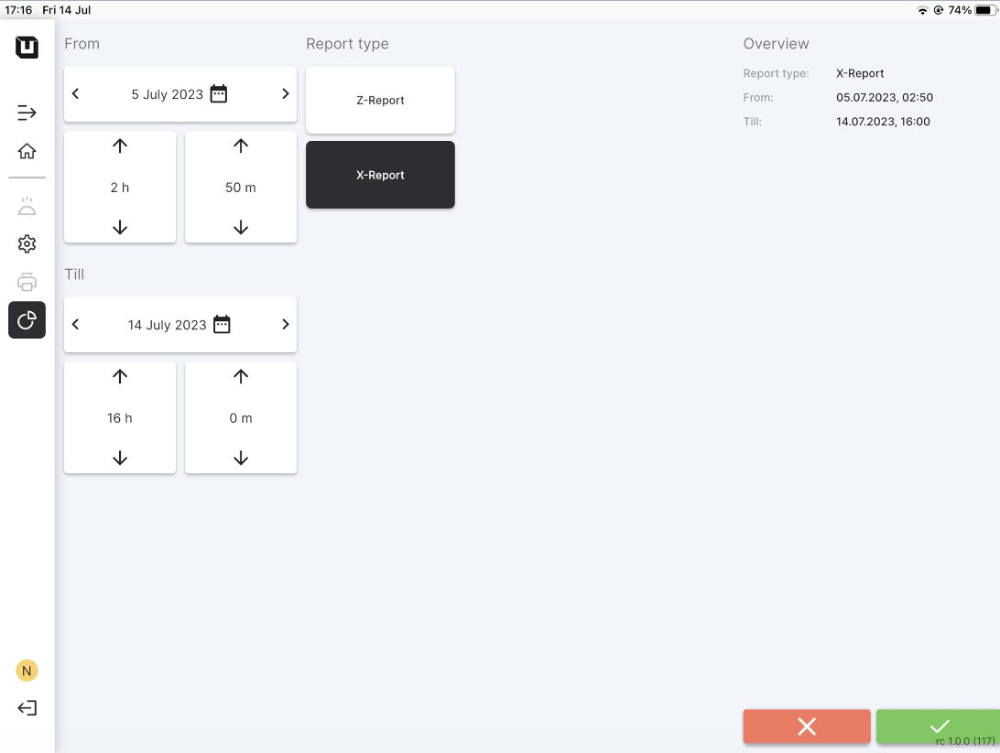

# X Reports

***

<table data-card-size="large" data-view="cards" data-full-width="false"><thead><tr><th></th><th></th><th></th></tr></thead><tbody><tr><td><strong>Who can use this feature?</strong></td><td>
✔<mark style="color:green;">Location Owners</mark> in the Back Office

✔<mark style="color:orange;">POS Users</mark> 
</td><td></td></tr></tbody></table>

### What's the X Report?

It's an overall total report for a selected period. X Reports have the same structure and clauses as Z Reports, but the distinction between them consists in the period of report. In X Reports you are able on one's own select the period of this report.

### What X Report includes?

* Overall turnover;
* Methods of payment and the final numbers of payments;
* Turnover for each waiter;
* Overview VAT.

<figure><figcaption>
Example of X Report
</figcaption></figure>

### How to get X Report?

To get a X Report, please follow these instructions:

1. Open the **'unTill Runner'** application on your tablet (if you don't have the application or your device isn't connected, please [refer to this manual](../general/equipment/add-a-device.md)).
2. In the POS navigate to the **'Reports'** section.
3. Click **'X Report'**.
4. Confirm this action.

<figure><figcaption></figcaption></figure>

5. Then in the Back Office navigate to the **'Reports' > 'X Reports'**.
6. Now you can open and print this report.
