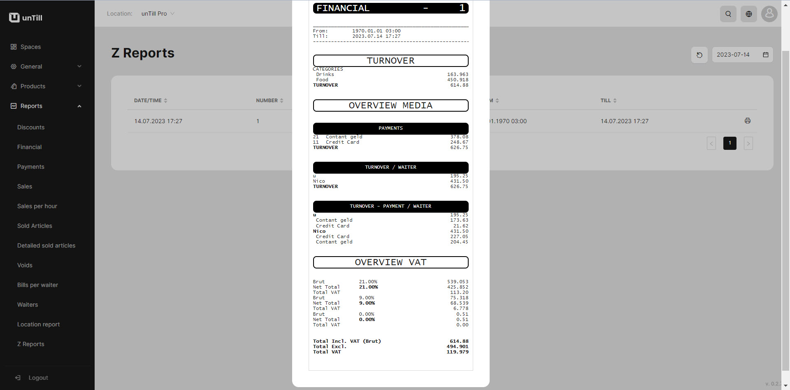
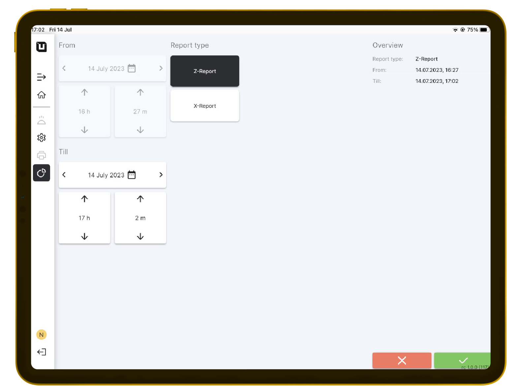

# Z Reports

***

<table data-card-size="large" data-view="cards" data-full-width="false"><thead><tr><th></th><th></th><th></th></tr></thead><tbody><tr><td><strong>Who can use this feature?</strong></td><td>
✔<mark style="color:green;">Location Owners</mark> in the Back Office

✔<mark style="color:orange;">POS Users</mark>
</td><td></td></tr></tbody></table>

### What's a Z Report?

At the end of a shift or working day, 'Z-reports' are generated, which serve as continuous sales reports that function as tax returns for the restaurant. These reports always cover all transactions within a certain time period and cannot be customized individually.

Additionally, 'Z Reports' provide an opportunity for the Location Owners to analyze the current turnover of the restaurant.

### What does a Z Report include?&#x20;

* Overall turnover;
* Methods of payment;
* Turnover for each waiter;
* Overview VAT.

<figure><figcaption>
Example of Z Report
</figcaption></figure>

### How to get a Z Report?

To get a 'Z Report', please follow these instructions:

1. Open the 'unTill Air' app on your tablet (If your device isn't connected, please [refer to ](../general/equipment/add-a-device.md)[the designated page](../general/equipment/add-a-device.md)).
2. In the POS navigate to the 'Reports' section.
3. Click 'Z Report'.
4. Confirm this action.

<figure><figcaption></figcaption></figure>

5. Next, in the Back Office, navigate to the 'Reports' > 'Z Reports'.
6. Now you can open and print this report.
